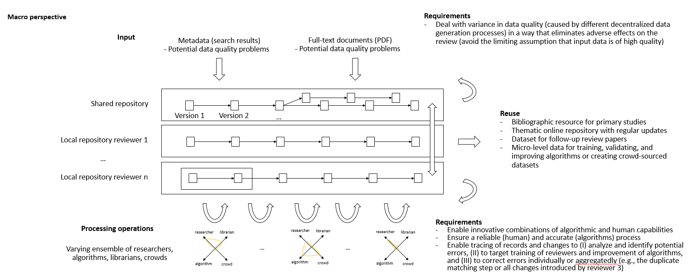
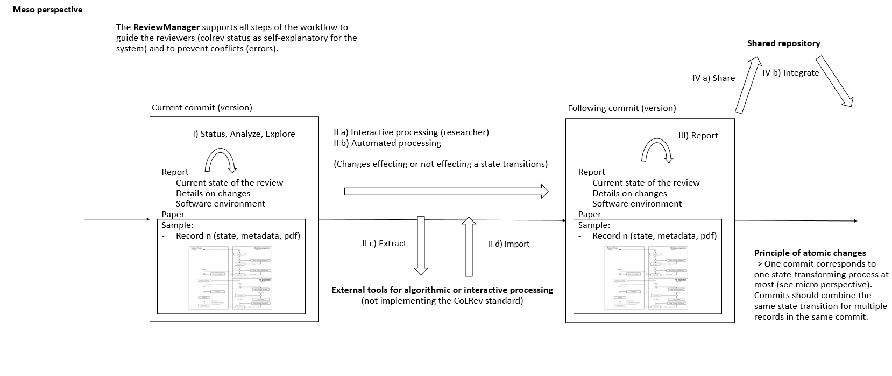
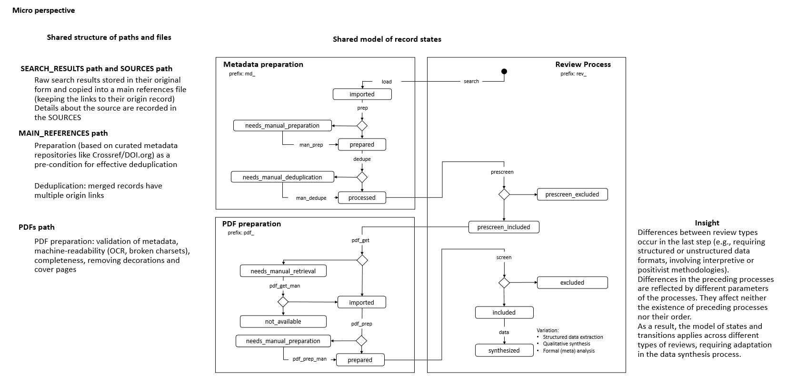
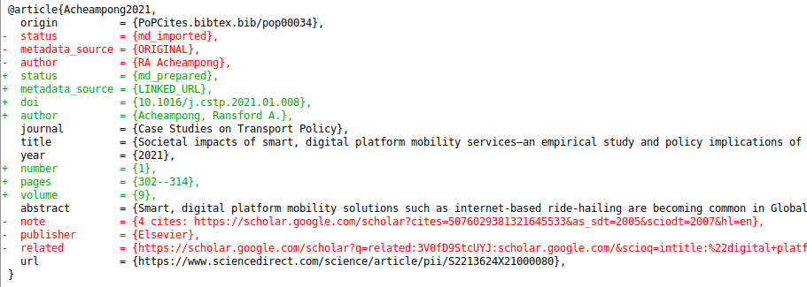
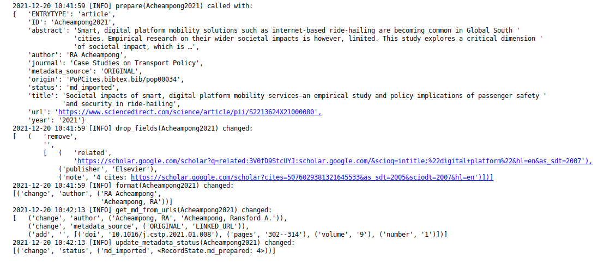

# CoLRev Core

[](https://github.com/geritwagner/colrev_core/releases/)
[](https://www.python.org/downloads/release/python-380/)
[](https://github.com/pre-commit/pre-commit)
[](https://github.com/geritwagner/colrev_core/releases/)

This repository contains the core engine for CoLRev (**C**olaborative **L**iterature **Rev**iews) and explains its architecture design principles.

# Usage

To use CoLRev, install the [CLI interface](https://github.com/geritwagner/colrev).
CoLRev consists of the following components:

- [colrev](https://github.com/geritwagner/colrev): command-line interface
- [colrev-core](https://github.com/geritwagner/colrev_core) (this repository): engine for git-based literature reviews (automatically installed)
- [colrev-hooks](https://github.com/geritwagner/colrev-hooks): pre-commit hooks to validate compliance with CoLRev (automatically installed)

Extensions are available at [Github](https://github.com/topics/colrev-extension) and a graphical user interface will be available soon.

# Architecture and design principles

A literature review is a collaborative process involving human-machine ensembles (authors, algorithms, crowds), which takes search results (metadata) and full-text documents as qualitativd, semistructured input to develop a synthesis. The result can take the form of a codified standalone review paper, a published as a web repository, or a curated locally as a living review.

It is commonly known that data generation processes are error prone (e.g., errors in the reference sections of primary papers, in the database indices, or in the machine-readability of PDFs) and as a result, each record (metadata or PDF) can have multiple data quality problems.
As a direct implication, metadata and PDFs, like data in any other research method, require dedicated preparation steps.

There is variance in how accurately authors and algorithms perform (e.g., disagreements in the screening process or performance of duplicate detection algorithms).
As an implication, control of process reliability (and constant improvement of algorithms) is needed, which requires transparency of atomic changes.

With ever growing volumes and heterogeneity of research, there is a growing need to allocate efforts rationally and based on evidence.
As an implication, we need to use prior research as crowdsourcing (e.g., for deduplication), we need to use evidence in the searches.

Literature reviews, in their current form, do not effectively leverage data from prior reviews (e.g., in the duplicate detection process, the preparation of metadata and PDFs, or the classification of documents).
As an implication, a clear vision for effectively establishing reuse paths is needed.


**TODO** :

- Mention shared philosophy/principles, goal of providing an extensible platform
- The goal of CoLRev is to facilitate collaborative reviews, making them more efficient, robust, and powered by SOTA/research-grade algorithms)



## Workflow

In its basic form, the workflow consists of iteratively calling ```colrev status``` > ```colrev process``` > ```git process```

The workflow is self-explanatory with ```colrev status``` recommending the next ```colrev process``` or ```git process```

The ReviewManager supports reviewers in completing the complexity of the review process (e.g., the order of individual steps and their dependencies) in collaborative settings (e.g., requiring synchronization between distributed local repositories).
Essentially, the ReviewManager operates in three modes:

- Autonomous: ReviewManager executes and supervises the process (e.g., loading new records)
- Supervised: ReviewManager is notified before a process is started, usually interactive processes requiring frequent user input (e.g., screening)
- Consulted: ReviewManager is called after files have been modified and checks for consistency (e.g., writing the synthesis)

In addition, the ReviewManager keeps a detailed report of (1) the review environmen and parameters (2) the current state of the review, and (3) the individual steps (commands) and the changes applied to the dataset ([example](figures/commit_report.png)).

**TODO**: summarize steps I-IV displayed in the figure



### Processing functions (transitions between record states)

```load```

  - This process must map field names to a common standard (BibTex) (e.g., Web of Science has "Author_Full_Names", which is "author" in BibTex). This mapping can be dependent on the database/source (and it may change over time).

```prepare```

  - Format fields (e.g., use ML to identify author first/last/middle names and format them)
  - Automatically update metadata if there is a high similarity with a record in a curated repository (e.g., DOI/CROSSREF).
  - Pragmatic assumption: the information provided by metadata repositories (like Crossref) is correct and complete
  - If the similarity is low:
    - If the record is missing fields (-> rules), has inconsistent fields or incomplete fields, mark for manual preparation
    - Else: mark as prepared
  - Efficient analysis requires transparency of the changes applied by each individual function (e.g., is it an error of the script, of the input data or of the curated repository?)

```man_prep```

```dedupe```

  - Records can be highly similar but not a duplicate (e.g., conference papers published as extended journal versions, or editorials that differ only in the journal-issue)
  - Records can be completely dissimilar but require merging (e.g., conference details linked through a crossref field in BibTex)
  - Duplicate detection performance critically depends on preparation
  - Duplicate detection sould be incremental, i.e., the pool of non-duplicated records is extended incrementally with new records being checked against existing records in the pool. Comparisons between records in the pool are not repeated. This is only possible if we meticulously track the status of records (after md_status=processed or not). Note: incremental merging is not possible with traditional workflows that do not rely on an explicit state model and corresponding fields. This can be a severe limitation for iterative searches!
  - If the similarity between records is not high enough for merging (and not low enough to mark them as non-duplicates), they are marked as "needs_manual_preparation".
  - Efficient analysis requires records to be adjacent in the MAIN_REFERENCES
  - **TODO** We also need to define how records are matched across levels - e.g., book vs. book-chapter, conference proceedings vs. in-proceedings paper

```man_dedupe```

```prescreen```
  - should support the identification of retracted papers, predatory journals, different languages

```pdf_get```
  - should automatically retrieve PDFs published as open access
  - should support the automated retrieval of PDFs from other projects (locally)

```pdf_get_man```

```pdf_prep```
  - Check correspondence between metadata and PDF (to avoid accidentally working with a different paper), check machine readability/OCR (to prevent problems in machine processing and processing by humans/e.g., when using the search functionality of PDF readers), remove additional pages/decorations that may interfere with automated analyses (e.g., cover pages, download-stamps), detect problems in charsets, blank pages etc.
  - Principles: only overwrite PDFs if the original PDF can be restored from git history (otherwise, save a backup copy before editing)
  - Each preparation script takes the last version of the PDF and creates a new copy (if it applies preparation changes). If the last step succeeds, the original PDF will be replaced (if there is a problem, having one PDF for each preparation step facilitates debugging).

```pdf_prep_man```

```screen```

```data```
  - Structured data formats should be stored in line-oriented formats (e.g., yaml/json), otherwise, git diffs can require a lot of cognitive effort to analyze
  - Tools should automatically feed additional records into the synthesis process/document sections and track whether each record has been synthesized (completeness condition)

- Each script: print detailed (minimal) information for potential error reporting
- TBD: principle: use all services that are made available


### Versioning and collaboration

- **TODO**: Summarize main advantages of git for collaborative literature reviews (collaborative codification, processing of semi-structured data)

- Git (as a synonym for distributed versioning systems): line-based versioning of text-files (challenge: merging)
- A commit corresponds to an individual processing step
- Version-history  (explicitly show where flexibility is needed - data extraction/analysis) - also mention git history (principles), commit messages, collaboration principles (local IDs)
- Pre-commit hooks advantage: the versioning system takes care of it (regardless of whether robots or researchers edit the content). We should use the hooks to avoid commits of broken states (untraceable changes). The hooks should exercise relatively strict control because not all authors of a review may be familiar with git/all principles of the review_template. For experts, it is always possible to override the hooks (--no-verify).
- One-branch principle (do not consider branching in the pipeline (yet??))
- Principle: commits should correspond to manual vs. automated contributions. They should reflect the degree to which checking is necessary. For instance, it makes sense to split the merging process into separate commits (the automated/identical ones and the manual ones)
- Git versions should be frequent but also well thought-through and checked/reviewed (no automated mixing/syncing of work with the project as in database-tools)
- Committed changes should be as small as possible for collaboration/merging purposes (also for checking/restoring)

## Data

The CoLRev framework is based on an oppinionated and well-justified selection of data structures, file-paths and operating principles.
Ideally, constraining the set of possible data formatting and storage options improves workflow efficiency (because tools and researchers share the same philosophy of data) without any side-effects on the anaylsis and synthesis process/outcomes.

The main goal of data structuring is to give users a transparent overview of (1) the detailed changes that were made, (2) by whom, and (3) why.
Having access to these data and being able ot analyze them efficiently is of critical importance to

1. develop confidence in the review process,
2. communicate and justify the trustworthiness of the results,
3. improve individual contributions (e.g., train research assistants, to validate algorithms),
4. be in a position to identify and remove contributions of individuals (algorithms or researchers) in case systematic errors are introduced,
5. efficiently extract data on individual steps (e.g., deduplication) for reuse (e.g., crowdsourcing)

Examples of transparency in different stages are provided below.

To accomplish these goals, CoLRev tracks a status for each record.

- The status is used to determine the current state of the review project
- It is used by the ReviewManager to determine which operations are valid according to the processing order (e.g., records must be prepared before they are considered for duplicate removal, PDFs have to be acquired before the main inclusion screen)
- Tracking record status enables incremental duplicate detection (record pairs that have passed deduplication once do not need to be checked again in the next iterations)
- Strictly adhering to the state machine allows us to rely on a simple data structure (e.g., status="synthesized" implies pdf-prepared, md-prepared, included, prescreen-included - no need to check consistency between different screening decisions)



Examples of transparency in preparation, deduplication, and screening:



Note : in this case, we see that the record was prepared (changing the status from ```md_imported``` to ```md_prepared```) based on the LINKED_URL (as explained by the ```metadata_source``` field).
The doi was extracted from the website (url) and used to update and complete the metadata (after checking whether it corresponds with the existing ```title```, ```author```, .... fields).
The processing report (part of the commit message) provides further details.



**TODO**: include examples for deduplication and screening.


Raw data sources
- Transformed to BibTex by CoLRev to facilitate more efficient processing
- Can be immutable (e.g., results extracted from databases) * Exception: fixing incompatibilities with BibTex Standard
- Can be in append-mode or even update-mode (e.g., for feeds that regularly query databases or indices like Crossref)

The MAIN_REFERENCES contain all records. They are sorted according to IDs, which makes it easy to examine deduplication decisions. Once propagated to the review process (the prescreen), the ID field (e.g., BaranBerkowicz2021) is considered immutable and used to identify the record throughout the review process.
To facilitate an efficient visual analysis of deduplication decisions (and preparation changes), CoLRev attempts to set the final IDs (based on formatted and completed metadata) when importing records into the MAIN_REFERENCEs (IDs may be updated until the deduplication step if the author and year fields change).

ID formats, such as three-author+year (automatically generated by CoLRev), is recommended because

  - semantic IDs are easier to remember (compared to arbitrary ones like DOIs or numbers that are incremented),
  - global identifiers (like DOIs or Web of Science accession numbers) are not available for every record (such as conference papers, books, or unpublished reports),
  - shorter formats (like first-author+year) may often require arbitrary suffixes

Individual records in the MAIN_REFERENCES are augmented with

- the ```status``` field to track the current state of each record in the review process and to facilitate efficient analyses of changes (without jumping between a references file and a screening sheet/data sheet/manuscript)
- the ```origin``` field to enable traceability and analyses (in both directions)


The order of the first fields is fixed to enable efficient status checks.

```bibtex
@article{BaranBerkowicz2021,
  origin          = {PoPCites.bibtex.bib/pop00082},
  status          = {md_prepared},
  metadata_source = {LINKED_URL},
  doi             = {10.3390/su13116494},
  author          = {Baran, Grzegorz and Berkowicz, Aleksandra},
  journal         = {Sustainability},
  title           = {Digital Platform Ecosystems as Living Labs for Sustainable Entrepreneurship and Innovation},
  year            = {2021},
  number          = {11},
  volume          = {13},
  url             = {https://www.mdpi.com/2071-1050/13/11/6494/pdf},
}
```

BibTex:

- Quasi-standard format that is supported by most reference managers and literature review tools for input/output [1](https://en.wikipedia.org/wiki/Comparison_of_reference_management_software).
- BibTex is easier for humans to analyze in git-diffs because field names are not abbreviated (this is not the case for Endnote .enl or .ris formats), it is line-based (column-based formats like csv are hard to analyze in git diffs), and it contains less syntactic markup that makes it difficult to read (e.g., XML or MODS).
- BibTex is easy to edit manually (in contrast to JSON) and does not force users to prepare the whole dataset at a very granular level (like CSL-JSON/YAML, which requires each author name to be split into the first, middle, and last name).
- BibTex can be augmented (including additional fields for the record origin, status, etc.)

## Extension development and best practices

Developing extensions of CoLRev in Python/R or other languages is easy. We provide examples and instructions below.

```Python3
import logging
from colrev_core.review_manager import ReviewManager, Process, ProcessType

# Set up the loggers
report_logger = logging.getLogger("review_template_report")
logger = logging.getLogger("extension")

# Initialize the ReviewManager
REVIEW_MANAGER = ReviewManager()
# Notify about the upcoming ProcessType (see colrev_core/review_manager.py)
REVIEW_MANAGER.notify(Process(ProcessType.prescreen))

# Load the records and process
bib_db = REVIEW_MANAGER.load_bib_db()
for record in bib_db.entries:
  ....

# Save the changes and create commit
bib_db = REVIEW_MANAGER.save_bib_db()
REVIEW_MANAGER.create_commit("Pre-screening (manual) based on PreScreenExtension")
```

- Add the ```colrev-extension``` topic tag on GitHub to allow others to find and use your work

**TODO**:
- include a link to further resources and example repositories
- include an R example
- Get all paths from REVIEW_MANAGER.paths (ABSOLUTE or RELATIVE)
- Logger (report vs tool/extension)
    - logg infos that are helpful to examine and validate the process to review_template_report logger.
    - logg infos on the progress to the review_template logger. keep the output relatively short, allowing users to see the progress and judge whether any errors occurred
- PDF paths should be relative to the git repositoriy (if PDFs are not versioend in git, this can be accomplished through ignored paths or symlinked directories)
- Commit message: link to docs with debugging-instructions
- Instead of throwing the raw build output at the user and telling them to figure it out, we detect the underlying cause, if we can, and provide them with a short, but descriptive failure message, with links to the relevant documentation.

# Credits

We build on the shoulders of amazing projects (growing giants) and benefit from their ongoing improvements

- [GitPython](https://github.com/gitpython-developers/GitPython), which is available under the [BSD 3-Clause License](https://github.com/gitpython-developers/GitPython/blob/main/LICENSE). [](https://github.com/gitpython-developers/GitPython)
- [pre-commit](https://github.com/pre-commit/pre-commit), which is available under the [MIT License](https://github.com/pre-commit/pre-commit/blob/master/LICENSE). [](https://github.com/pre-commit/pre-commit.six)
- [docker-py](https://github.com/docker/docker-py), which is available under the [Apache-2.0 License](https://github.com/docker/docker-py/blob/master/LICENSE). [](https://github.com/docker/docker-py)
- [pandas](https://github.com/pandas-dev/pandas), which is available under the [BSD 3-Clause License](https://github.com/pandas-dev/pandas/blob/master/LICENSE). [](https://github.com/pandas-dev/pandas)
- [PDFMiner.six](https://github.com/pdfminer/pdfminer.six), which is available under the [MIT License](https://github.com/pdfminer/pdfminer.six/blob/develop/LICENSE). [](https://github.com/pdfminer/pdfminer.six)
- [bibtexparser](https://github.com/sciunto-org/python-bibtexparser), which is available under the [BSD License](https://github.com/sciunto-org/python-bibtexparser/blob/master/COPYING).

Dynamically loaded

- [git](https://github.com/git/git), which is available under the [GNU Public License 2 (GPL 2)](https://github.com/git/git/blob/master/COPYING). [](https://github.com/git/git)
- [GROBID](https://github.com/kermitt2/grobid), which is available under the [Apache 2.0 License](https://github.com/kermitt2/grobid/blob/master/LICENSE). [](https://github.com/kermitt2/grobid)
- [OCRmyPDF](https://github.com/jbarlow83/OCRmyPDF), which is available under the [Mozilla Public License 2.0 (MPL-2.0)](https://github.com/jbarlow83/OCRmyPDF/blob/master/LICENSE). [](https://github.com/jbarlow83/OCRmyPDF), which builds on
- [Tesseract OCR](https://github.com/tesseract-ocr/tesseract), which is available under the [Apache-2.0 License](https://github.com/tesseract-ocr/tesseract/blob/main/LICENSE). [](https://github.com/tesseract-ocr/tesseract)
- [pandoc](https://github.com/jgm/pandoc), which is available under the [GNU Public License 2 (GPL 2)](https://github.com/jgm/pandoc/blob/master/COPYRIGHT). [](https://github.com/jgm/pandoc)
- [bibutils](http://bibutils.refbase.org/), which is available under the [GNU Public License (GPL)](http://bibutils.refbase.org/).

For meta-data preparation and PDF retrieval, we rely on the following data sources

- [Crossref](https://www.crossref.org/) with over 125,000,000 curated metadata records across disciplines
- [Semantic Scholar](https://www.semanticscholar.org/) with over 175,000,000 records across disciplines
- [dblp](https://dblp.org/) with over 5,750,000 curated metadata records in the IT/IS disciplines
- [Open Library](https://openlibrary.org/) with over 20,000,000 curated metadata records (books)
- [Unpaywall](https://unpaywall.org/) with over 30,000,000 free papers

# Contributing, changes, and releases


Contributions, code and features are always welcome

- See [contributing guidelines](CONTRIBUTING.md).
- Bug reports or feedback? Please use the [issue tracker](https://github.com/geritwagner/colrev_core/issues) and let us know.
- To get your work included, fork the repository, implement your changes, and create a [pull request](https://docs.github.com/en/github/collaborating-with-issues-and-pull-requests/proposing-changes-to-your-work-with-pull-requests/about-pull-requests).

For further information, see [changes](CHANGELOG.md) and [releases](https://github.com/geritwagner/colrev_core/releases).

# License

This project is distributed under the [MIT License](LICENSE) the documentation is distributed under the [CC-0](https://creativecommons.org/publicdomain/zero/1.0/) license.
If you contribute to the project, you agree to share your contribution following these licenses.
