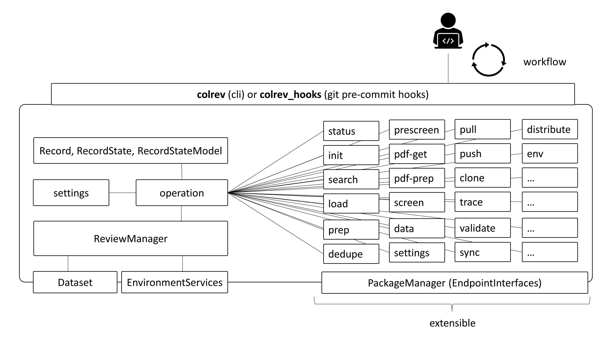

API reference
========================================
..
   DO NOT DELETE THIS FILE! It contains the all-important `.. autosummary::` directive with `:recursive:` option, without
   which API documentation wouldn't get extracted from docstrings by the `sphinx.ext.autosummary` engine. It is hidden
   (not declared in any toctree) to remove an unnecessary intermediate page; index.rst instead points directly to the
   package page. DO NOT REMOVE THIS FILE!

The package interfaces are documented :doc:`here </dev_docs/packages>`.

.. autosummary::
   :toctree: _autosummary
   :template: custom-module-template.rst
   :recursive:

   colrev

**Interfaces**

.. autosummary::
   :toctree:
   :template: custom-module-template.rst
   :recursive:

   colrev.ui_cli
   colrev.hooks

**High-level (project)**

.. autosummary::
   :toctree:
   :template: custom-module-template.rst
   :recursive:

   colrev.review_manager
   colrev.settings
   colrev.ops
   colrev.process
   colrev.dataset

**High-level (environment)**

.. autosummary::
   :toctree:
   :template: custom-module-template.rst
   :recursive:

   colrev.env
   colrev.package_manager

**Low-level**

.. autosummary::
   :toctree:
   :template: custom-module-template.rst
   :recursive:

   colrev.constants
   colrev.logger
   colrev.exceptions
   colrev.paths
   colrev.loader
   colrev.writer
   colrev.record
