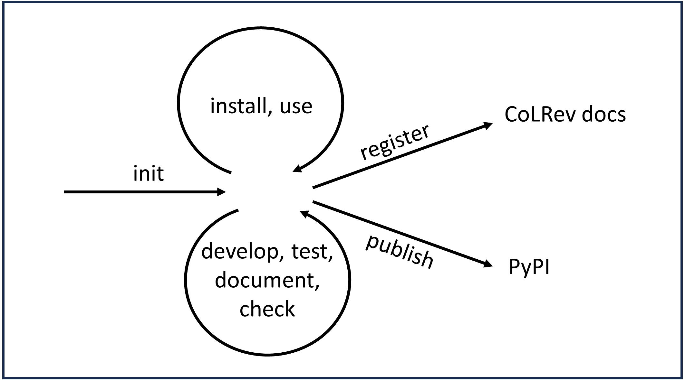

Package development
=====================

CoLRev packages are Python packages that extend CoLRev by relying on its shared data structure and standard process.
Specifically, a CoLRev package can extend package base classes, such as the `ReviewTypePackageBaseClass <packages/package_base_classes.html#colrev.package_manager.package_base_classes.ReviewTypePackageBaseClass>`_, or the `SearchSourcePackageBaseClass <packages/package_base_classes.html#colrev.package_manager.package_base_classes.SearchSourcePackageBaseClass>`_, to implement custom functionality for a specific task or data source.
In addition, packages can provide complementary functionalities (e.g., for ad-hoc data exploration and visualization) without extending a specific base class.

The following guide explains how to develop built-in packages, i.e., packages that reside in the `packages <https://github.com/CoLRev-Environment/colrev/tree/main/colrev/packages>`_ directory. Built-in packages should also be registered as a dependency in the `pyproject.toml <https://github.com/CoLRev-Environment/colrev/blob/main/pyproject.toml>`_.



..
    CoLRev comes with batteries included, i.e., a reference implementation for all steps of the process. At the same time you can easily include other packages or custom scripts (batteries are swappable). Everything is specified in the settings.json (simply add the package/script name as the endpoint in the ``settings.json`` of the project):

    .. code-block:: diff

    ...
        "screen": {
            "criteria": [],
            "screen_package_endpoints": [
                {
    -             "endpoint": "colrev.colrev_cli_screen"
    +             "endpoint": "custom_screen_script"
                }
            ]
        },
        ...

  * In case of external packages, you need to register it by updating ``packages.json`` but it's not required for built-in packages.
  Examples
  ========
  - `colrev-asreview <https://github.com/CoLRev-Environment/colrev-asreview>`_
  * Register the package to the cloned CoLRev by editing the ``colrev/packages/packages.json`` file e.g.:
    ..  code-block:: diff
        ...
          {
              "module": "colrev",
              "url": "https://github.com/CoLRev-Environment/colrev"
          },
        + {
        +     "module": "colrev_asreview",
        +     "url": "https://github.com/CoLRev-Environment/colrev-asreview"
        + }
    For development and testing purpose it’s convenient to fork the CoLRev repository, setup a venv with the forked repository, and work on the package. Once the package is developed, and working as expected, you can make a pull request to original repository to register your package.

    Following steps might be a good starting point.

    * Fork and clone CoLRev
    * Setup a virtualenv, all the followings steps assumes the same virtualenv used throughout
    * Install the cloned CoLRev using pip command ``pip install -e /path/to/cloned/colrev``

      .. note::

          ``-e`` allows editable installation. Any changes made will be available immediately

    * Create the package repository e.g.: https://github.com/CoLRev-Environment/colrev-asreview

      .. note::

          You can simply use `this repository <https://github.com/CoLRev-Environment/colrev-asreview>`_ as the ground for your package

    * `Add <https://docs.github.com/en/repositories/managing-your-repositorys-settings-and-features/customizing-your-repository/classifying-your-repository-with-topics>`_ the ```colrev-packages``` `topic tag on GitHub <https://github.com/topics/colrev-package>`_ to allow others to find and use your work.

Init
------

To create a new CoLRev package, the following command sets up the necessary directories, files, and code skeleton:

.. code-block:: bash

    colrev package --init

To check the package structure and metadata, use the following command:

.. code-block:: bash

    colrev package --check

Install and use
-----------------

To install a CoLRev package, you can use the following command (`pip install <package_name>` is also possible):

.. code-block:: bash

    colrev install <package_name>

Once installed, packages that extends a base class can be used in the standard process by registering the package in the `settings.json` of a project (e.g., by running `colrev search --add <package_name>`).

Creating a new CoLRev package
----------------------------------------

To create a new CoLRev package, the following command sets up the necessary directories, files, and code skeleton:

.. code-block:: bash

    colrev package --init

..
  .. raw:: html

    <div id="demo"></div>

    <script src="_static/js/asciinema-player.min.js"></script>
    <script>
        window.onload = function() {
          AsciinemaPlayer.create('_static/colrev_package_init.cast', document.getElementById('demo'),
          {autoPlay: true,
          rows: 30,
          terminalFontSize: "80px",
          theme: 'dracula',});
        };
    </script>

Develop, test, document and check
-----------------------------------

The `init` command should set up the package structure and metadata. The following sections provide more details on how to develop, test, document, and check the package.

It is recommended to run the following check regularly:

.. code-block:: bash

    colrev package --check

Package structure
------------------

A package contains the following files and directories:

   ::

    ├── pyproject.toml
    ├── README.md
    ├── src
    │   ├── __init__.py
    │   ├── package_functionality.py

..
       ├── .pre-commit-config.yaml
   .. note::

      The``.pre-commit-config.yaml`` should be copied from the CoLRev repo to ensure CoLRev’s coding standards

The package metadata is stored in the ``pyproject.toml`` file. The metadata is used by the CoLRev to identify the package and its dependencies. The metadata should include the following fields:

   ::

    [project]
    name = "colrev.abi_inform_proquest"
    description = "CoLRev package for abi_inform_proquest"
    version = "0.1.0"
    authors = [
      { name = "Gerit Wagner", email = "gerit.wagner@uni-bamberg.de" },
    ]
    license = "MIT"
    requires-python = ">=3.8, <4"
    repository = "https://github.com/CoLRev-Environment/colrev/blob/main/colrev/packages/sync"


    [tool.hatch.build.targets.wheel]
    packages = ["src"]

    [tool.colrev]
    colrev_doc_description = "Package for sync"
    colrev_doc_link = "README.md"
    search_types = ["API", "TOC", "MD"]

    [project.entry-points.colrev]
    search_source = "colrev.packages.abi_inform_proquest.src.package_functionality:ABIInformProQuestSearchSource"

The `[project.entry-points.colrev]` section specifies which base classes are extended. The value contains the module path and the class name. The module path is relative to the package directory.

Develop
^^^^^^^^^^^^^^^^^^^^^^^

Package development is done in the `src` directory. The package should extend the respective base class(es).

Best practices

* Remember to install CoLRev in editable mode, so that changes are immediately available (run `pip install -e /path/to/cloned/colrev`)
* Check the other package implementations for getting a good idea on how to proceed
* Use the `colrev constants <https://github.com/CoLRev-Environment/colrev/blob/main/colrev/constants.py>`__
* Get paths from review_manager
* Use the ``logger`` and ``colrev_report_logger`` to help users examine and validate the process, including links to the docs where instructions for tracing and fixing errors are available.
* Before committing do a pre-commit test
* Use uv for dependency management (run `uv add <package_name>` to add a new dependency)
* Once the package development is completed, make a pull request to the CoLRev origin repository, with brief description of the package.
* The ``add_endpoint`` is only required for SearchSources. It is optional for other packages.

Packages allow packages to implement functionality that can be called in the :doc:`standard process </manual/operations>` if users register the package in the `settings.json` of a project.

To implement an endpoint, the `tool.colrev` section of `pyproject.toml` must provide a reference to the class which inherits from the respective :doc:`base classes </dev_docs/packages/package_base_classes>`. The reference is a string that contains the module path and the class name. The module path is relative to the package directory.

The following endpoint - abstract base class pairs are available:

.. list-table::
   :widths: 50 50
   :header-rows: 1

   * - Endpoint
     - Abstract base class
   * - review_type
     - `ReviewTypePackageBaseClass <packages/package_base_classes.html#colrev.package_manager.package_base_classes.ReviewTypePackageBaseClass>`_
   * - search_source
     - `SearchSourcePackageBaseClass <packages/package_base_classes.html#colrev.package_manager.package_base_classes.SearchSourcePackageBaseClass>`_
   * - prep
     - `PrepPackageBaseClass <packages/package_base_classes.html#colrev.package_manager.package_base_classes.PrepPackageBaseClass>`_
   * - prep_man
     - `PrepManPackageBaseClass <packages/package_base_classes.html#colrev.package_manager.package_base_classes.PrepManPackageBaseClass>`_
   * - dedupe
     - `DedupePackageBaseClass <packages/package_base_classes.html#colrev.package_manager.package_base_classes.DedupePackageBaseClass>`_
   * - prescreen
     - `PrescreenPackageBaseClass <packages/package_base_classes.html#colrev.package_manager.package_base_classes.PrescreenPackageBaseClass>`_
   * - pdf_get
     - `PDFGetPackageBaseClass <packages/package_base_classes.html#colrev.package_manager.package_base_classes.PDFGetPackageBaseClass>`_
   * - pdf_get_man
     - `PDFGetManPackageBaseClass <packages/package_base_classes.html#colrev.package_manager.package_base_classes.PDFGetManPackageBaseClass>`_
   * - pdf_prep
     - `PDFPrepPackageBaseClass <packages/package_base_classes.html#colrev.package_manager.package_base_classes.PDFPrepPackageBaseClass>`_
   * - pdf_prep_man
     - `PDFPrepManPackageBaseClass <packages/package_base_classes.html#colrev.package_manager.package_base_classes.PDFPrepManPackageBaseClass>`_
   * - screen
     - `ScreenPackageBaseClass <packages/package_base_classes.html#colrev.package_manager.package_base_classes.ScreenPackageBaseClass>`_
   * - data
     - `DataPackageBaseClass <packages/package_base_classes.html#colrev.package_manager.package_base_classes.DataPackageBaseClass>`_

Documentation
-----------------

* Link the documentation (`README.md`) in the pyproject.toml.
* See `tests/REAMDE.md <https://github.com/CoLRev-Environment/colrev/tree/main/docs>`_ for details on building the CoLRev docs.
* CLI demonstrations can be recorded with `asciinema <https://docs.asciinema.org/getting-started/>`_.

Testing
-----------

* Tests for built-in packages are currently in the tests of the CoLRev packages.
* See `tests/REAMDE.md <https://github.com/CoLRev-Environment/colrev/tree/main/tests>`_ for details.

Document
^^^^^^^^^^^^^^^^^

* Link the documentation (`README.md`) in the pyproject.toml.
* See `docs/REAMDE.md <https://github.com/CoLRev-Environment/colrev/tree/main/docs>`_ for details on building the CoLRev docs.
* CLI demonstrations can be recorded with `asciinema <https://docs.asciinema.org/getting-started/>`_.

Publish
------------

* Standalone CoLRev packages are published on PyPI.
* Built-in packages are not published separately. They are automatically provided with every PyPI-release of CoLRev.

Register
----------------

To have a package registered as an official CoLRev package, create a pull-request adding it to the `packages.json <https://github.com/CoLRev-Environment/colrev/blob/main/colrev/package_manager/packages.json>`_.

To integrate the package documentation into the official CoLRev documentation, the CoLRev team

* Reviews the package.
* Assigns a package status.
* Runs the ``colrev env --update_package_list`` command. This updates the `package_endpoints.json <https://github.com/CoLRev-Environment/colrev/blob/main/docs/source/manual/package_endpoints.json>`_, and the `search_source_types.json <https://github.com/CoLRev-Environment/colrev/blob/main/docs/source/manual/search_source_types.json>`_, which are used to generate the documentation pages.

Package development resources
------------------------------

.. toctree::
   :maxdepth: 1

   packages/package_base_classes
   packages/linters
   packages/custom_packages
   packages/python
   packages/r
