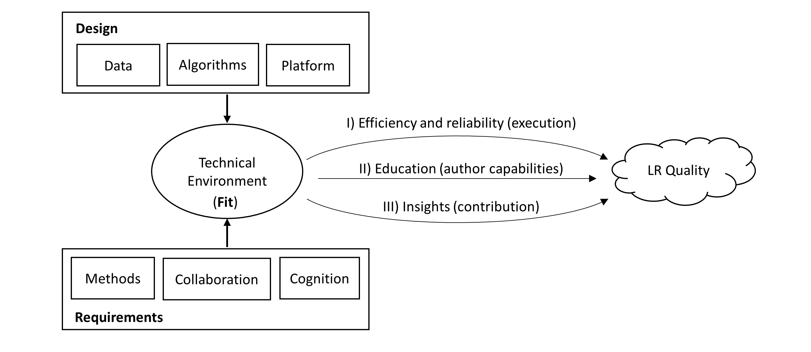

CEP001 - CoLRev Framework
====================================

+----------------+------------------------------------------------------------------------------------------------------------------------------------+
| **Author**     | Gerit Wagner, Julian Prester                                                                                                       |
+----------------+------------------------------------------------------------------------------------------------------------------------------------+
| **Status**     | Draft                                                                                                                              |
+----------------+------------------------------------------------------------------------------------------------------------------------------------+
| **Created**    | 2022-09-01                                                                                                                         |
+----------------+------------------------------------------------------------------------------------------------------------------------------------+
| **Discussion** | TODO : link-to-issue                                                                                                               |
+----------------+------------------------------------------------------------------------------------------------------------------------------------+
| **License**    | `Creative Commons Attribution-NonCommercial-NoDerivs 3.0 License <https://creativecommons.org/licenses/by-nc-nd/3.0/us/>`_         |
+----------------+------------------------------------------------------------------------------------------------------------------------------------+

Table of contents
------------------------------

:any:`summary`

:any:`area_methods`

- :any:`research_framework`
- :any:`shared_model`
- :any:`systematicity_transparency`
- :any:`typological_plurism`

:any:`area_design`

- :any:`architecture`
- :any:`Git_lr`
- :any:`data_structures_provenance`
- :any:`algorithms`

:any:`area_cognition`

- :any:`user_workflow`
- :any:`priority_processing`
- :any:`validate_and_undo`

:any:`area_community`

- :any:`adopting_a_shared_curation_standard`
- :any:`curation_layers`
- :any:`curation_per_default`

..  Note : this page should mirror the areas of innovation (first page)

.. _summary:

Abstract
------------------------------

The Collaborative Literature Reviews (CoLRev) framework provides a standardized environment, an extensible core, and a reference implementation for conducting highly collaborative reviews with a team of researchers and state-of-the-art algorithms.

Definitions:

A **literature review** is a collaborative process involving researcher-crowd-machine ensembles, which takes records (search results in the form of metadata) and full-text documents as qualitative, semi-structured input to develop a synthesis. The result can take different forms, including codified standalone review papers, published web repositories, or a locally curated living reviews.

Guiding principles:

- **Fit**: adaptability/configurability: research goals, type of review, methodological coherence, disciplines, expertise of users - design for humans/self-explanatory
- **Rigor**: selection and improvement of the best algorithms, transparency of changes, suggesting rigorous defaults, reporting is at the discretion of users
- **Openness**: related to data, software and users - especially design for reuse of curated data, of the best algorithms, of prior reviews (each project should enable the broadest extent of reuse scenarios, ideally even those that were not anticipated at the time of publication)

..
   Open source software (facilitate competition without lock-in, extensibility)
   Leverage powerful tools and libraries (benefit from their ongoing improvements)
   Integration with other tools/environments
   Transparency
   Design for humans (set reasonable defaults that are in line with a systematic approach, make commands and code self-explanatory, human processing time is valuable - prefer supervised execution and correction of algorithms to highly labor-intensive manual editing when algorithm performance is reasonably high, make it easy to identify, trace and correct errors in the project and at source)

   Assumptions:

   Processes generating the metadata, references, full-text documents are inherently decentralized and error prone, and, as a result, each record (metadata or PDF) can have multiple **data quality issues**.
   For example, there can be errors in the reference sections of primary papers, in the database indices, or in the machine-readability of PDFs.
   As a direct implication, metadata and PDFs, like data in any other research method, require dedicated preparation steps.

   There is **variance in how accurately authors, crowds and algorithms perform** (e.g., performance of duplicate detection algorithms or disagreements in the screening process).
   As an implication, control of process reliability (and constant improvement of algorithms) is needed, which requires transparency of atomic changes.
   As an implication of error-prone data generation processes and variance in processing accuracy, efficient error-tracing and debugging functionality must be built-in.

   With ever growing volumes and heterogeneity of research, there is a growing **need to allocate efforts rationally and evidence-based**.
   Literature reviews, in their current form, do not effectively leverage data from prior reviews (e.g., in the duplicate detection process, the preparation of metadata and PDFs, or the classification of documents).
   As an implication, a clear vision for effectively leveraging evidence and establishing reuse paths (e.g., crowdsourcing) is needed.

   Efficient and transparent access to changes is of critical importance to:

   - develop confidence in the review process
   - communicate and justify the trustworthiness of the results
   - improve individual contributions (e.g., train research assistants, to validate algorithms)
   - be in a position to identify and remove contributions of individuals (algorithms or researchers) in case systematic errors are introduced
   - efficiently extract data on individual steps (e.g., deduplication) for reuse (e.g., crowdsourcing)

   .. figure:: ../../../figures/macro_framework.png
      :alt: Macro framework

.. _area_methods:

1. Area: Methods
----------------------------------------------

.. _research_framework:

1.1 Framework for (reproducible) research
^^^^^^^^^^^^^^^^^^^^^^^^^^^^^^^^^^^^^^^^^^^^

Established frameworks for reproducible research using Git do not apply to literature reviews:

- **Dynamics**: Common notions of raw/immutable input data do not apply. In literature reviews, data and interpretations evolve dynamically throughout the process.
- **Non-determinism**: Common notions of deterministic computational processing operations do not apply. In literature reviews, processing operations are often manual, rely on external (changing) data sources and are inherently non-deterministic.
- **Atomicity**: Common notions of processing the dataset as a whole are insufficient, i.e., the in-memory-processing model, as exemplified by the tidyverse pipe operators, does not apply. In literature reviews, processing occurs on a per-paper basis, requiring validation and (potentially) corrections on a more granular level.
- **Structure**: Common notions of data as structured lists-of-unique-observations do not apply. In literature reviews, search results (metadata) are retrieved redundantly from multiple sources (to compensate for imperfect coverage/errors in the retrieval procedures) and associations between structured metadata and semi-structured full-text documents can form complex, layered graphs.

.. _shared_model:

1.2 Shared model for the steps of the review process
^^^^^^^^^^^^^^^^^^^^^^^^^^^^^^^^^^^^^^^^^^^^^^^^^^^^^^^^^^^^^^^^^^^^^^^^^^^^^^^^^^^^^^^^
Effectively synchronizing work across teams of researchers, applying algorithms, and incorporating crowd-sourced changes requires a model defining a shared understanding of the review process.
The model is enforced by the environment and the command-line interface provides convenience access to the reference implementation.
The overview defines the micro-level steps and situates them in the three macro-level processes of metadata preparation, full-text preparation and the main review process.
Each step can effect a state transition for a record, as recorded in the *status* field.
Key considerations are documented in the guides for the reference implementation.

.. _systematicity_transparency:

1.3 Systematicity and transparency
^^^^^^^^^^^^^^^^^^^^^^^^^^^^^^^^^^^^^^^^^^^^

The design of tools can have a profound impact on the systematicity (internal rigor) and transparency (external rigor, as reported) of literature reviews.

- Per default, tools should encourage high levels of systematicity (internal rigor) and provide functionality that efficiently supports systematic review practices.
- It should be at the users discretion to choose higher or lower degrees of systematicity. This is particularly relevant if systematicity requires additional manual efforts that may not be in line with the goals and nature of the review.

Note: When presenting a literature review, "qualitative systematic reviews" (as a very particular type of review) should be distinguished from general notions of literature reviews (that are conducted in a systematic manner). Every review varies on a scale of systematicity and transparency .

..
   It should be at the discretion of authors
   - It is a leGitimate decision for some literature reviews to place less emphasis on a detailed and explicit reporting (transparency).

.. _typological_plurism:

1.4 Typological pluralism
^^^^^^^^^^^^^^^^^^^^^^^^^^^^^^^^^^^^^^^^^^^^

The methodological literature increasingly emphasizes typological pluralism, referring important differences between types of reviews, such as qualitative systematic reviews, theory development reviews, scoping reviews, or meta-analyses.
As a result, a key question is how literature review technology should differ depending on the type of review.
The main propositions of CoLRev are:

- The generic literature review process (search, prescreen, screen, synthesize with the corresponding record management steps) applies to all types of reviews.
- The most substantial differences are found in the synthesis step, which involves different types of data (e.g., structured, unstructured), different forms of synthesis (e.g., narrative, statistical) and subtasks (e.g., quality appraisal, meta-analysis, manuscript development).
- In the other processes, differences between review types manifest in different parameters.
- As an implication, tools should be designed to synergize in all operations that precede the synthesis and provide flexibility for different forms of synthesis that are in line with the respective type of review.

.. _area_design:

2. Area: Design
------------------------------------

.. _architecture:

2.1 Architecture
^^^^^^^^^^^^^^^^^^^^^^

The architecture of CoLRev is divided into three packages:

- The CoLRev environment, **colrev**, operates standardized data structures and a process model on top of Git repositories. It also offers an extensible reference implementation covering all process steps of the review process.
- The CoLRev hooks, **colrev_hooks** (i.e., custom Git pre-commit hooks) check conformance with the standardized structures before a new version of the project (Git commit) is created.
- The CoLRev command line interface, **colrev** (cli), provides access to the processing operations and additional features. Complexity is hidden behind the three-step workflow and the ``colrev status`` command that provides instructions based on the context of the project.

The extensible part of **colrev** adopts **batteries included but swappable** as a principle to reconcile the need for an efficient end-to-end process with the possibility to select and combine specific tools. Users can -- for each step of the review process -- rely on the powerful reference implementation of CoLRev or select custom tools.

..
   The **ReviewManager** supports reviewers in dealing with the complexity of the review process (e.g., the order of individual steps and their dependencies) in collaborative settings (e.g., requiring synchronization between distributed local repositories).
   Essentially, the ReviewManager operates in three modes:

   - Autonomous: ReviewManager executes and supervises the process (e.g., loading new records)
   - Supervised: ReviewManager is notified before a process is started, usually interactive processes requiring frequent user input (e.g., screening)
   - Consulted: ReviewManager is called after files have been modified and checked for consistency (e.g., writing the synthesis)

   In addition, the ReviewManager keeps a detailed `report <../guides/manual/1_workflow.html#colrev-validate>`_ of (1) the review environment and parameters (2) the current state of the review, and (3) the individual steps (commands) and the changes applied to the dataset.

   principle: review manager is instantiated for the current commit, not for historical commits.
   the data strucutres of colrev_status/colrev_origin will not change as much as the colrev_settings etc.?

   Ecosystem principles: modularity (recombination), open-source (evaluation, inspection, improvement)

.. _Git_lr:

2.2 Git for literature reviews
^^^^^^^^^^^^^^^^^^^^^^^^^^^^^^^^^^^^^^^^^^^^

The CoLRev environment tightly integrates with the transparent collaboration model of Git for the entire review process. A key lessons from the tidyverse (R) is that a shared philosophy of the data is instrumental for collaboration, as well as the application and development of functionality provided by complementary packages. The design is based on the following versioning and collaboration principles:

- As a foundation, Git provides the full flexibility of `distributed workflow setups <https://git-scm.com/book/en/v2/Distributed-Git-Distributed-Workflows>`_.
- CoLRev serves as the database management system (or "workflow engine") that takes care of data consistency, operates a shared model of the review steps, and thereby enables collaboration. This is a missing element in current Git-based literature reviews.
- It should always be possible to edit the data directly. Before creating a commit, the validation and formatting of changes is automatically triggered by the pre-commit hooks. This built-in feature makes CoLRev projects fault-tolerant and facilitates collaboration through Git.
- Commits should be atomic. A commit corresponds to an individual operation, which facilitates validation efforts. Commits and pushes/pulls should be frequent to avoid merge conflicts.
- CoLRev uses Git to facilitate collaboration between researchers and machines. As such, all operations should be prepared to be called by humans or machines. For example, the search could be updated manually or by a Github action. This does not mean that all steps should be completed automatically. For example, if the setup requires manual screening, machines should be able to call the screen operation, but it should not lead to record state transitions.

Notes:

- Git is used most effectively for line-based versioning of text-files. Visualizing changes is more demanding for structured data (csv) and impossible for binaries (e.g., Word documents).
- Versions are accompanied by a commit report, which provides a quick overview of the status.

..
   The notion of atomic processing of individual records underlines the need for a shared model of the review process.
   Such a state model will shape the data structures, the processing operations and workflow and the content curation.
   - Commits should correspond to manual vs. automated contributions. They should reflect the degree to which checking is necessary. For instance, it makes sense to split the merging process into separate commits (the automated/identical ones and the manual ones)
   The hooks should exercise relatively strict control because not all authors of a review may be familiar with Git/all principles of the review_template. For experts, it is always possible to override the hooks (--no-verify)
   - CoLRev builds on Git as the most capable collaborative versioning system currently available.
   - Git was originally developed as a distributed versioning system for (software) source code. The collaborative development of software code (semi-structured data) resembles scientific research processes (especially when analyses are implemented in Python or R scripts) and Git has been an integral part of the reproducible research movement. A particular strength of Git is its capability to merge different versions of a repository.

.. _data_structures_provenance:

2.3 Data structures and provenance
^^^^^^^^^^^^^^^^^^^^^^^^^^^^^^^^^^^^^^^^^^^^

..
   Connect to (even link?) text from the readme:
   Creating an extensible ecosystem of file-based interfaces following open data standards
   implementing a granular data provenance model and a robust identification scheme.

The CoLRev framework is based on an opinionated and scientifically grounded selection of data structures, file-paths and operating principles.
Ideally, constraining the set of possible data formatting and storage options improves workflow efficiency (because tools and researchers share the same philosophy of data), freeing time and mental energy for literature analysis and synthesis.

The main goal of data structuring is to give users a transparent overview of (1) the detailed changes that were made, (2) by whom, and (3) why.
To accomplish these goals, CoLRev tracks a `colrev_status` for each record (see the :ref.`model <operations>`):

- The `colrev_status` is used to determine the current state of the review project.
- It is used by the ReviewManager to determine which operations are valid according to the order of operations (e.g., records must be prepared before they are considered for duplicate removal, PDFs have to be acquired before the main inclusion screen).
- Tracking the `colrev_status`` enables incremental duplicate detection (record pairs that have passed deduplication once do not need to be checked again in the next iterations).
- Strictly adhering to the state machine allows us to rely on a simple data structure (e.g., `colrev_status="synthesized"`` implies `pdf_prepared`, `md_prepared`, `rev_included`, `rev_prescreen_included`).
- An underlying assumption is that different types of reviews share the same process model (with different parameters) and that the main differences are in the data extraction and analysis stages (e.g., requiring structured or unstructured data formats).

The data structures distinguish raw data sources (stored in `data/search/`) and the main records (stored in `data/records.bib`).

Raw data sources:

- Raw data sources represent the latest version of the records retrieved from source, i.e., they can be updated by API-based sources. Manual edits should be applied to the main records (`data/records.bib`).

..
   - Can be in append-mode or even update-mode (e.g., for feeds that regularly query databases or indices like Crossref)
   Can be immutable (e.g., results extracted from databases). Exception: fixing incompatibilities with BibTeX Standard

Main records:

- The file contains all records.
- It is considered the single version of truth with a corresponding version history.
- Records are sorted according to IDs, which makes it easy to examine deduplication decisions. Once propagated to the review process (the prescreen), the ID field (e.g., BaranBerkowicz2021) is considered immutable and used to identify the record throughout the review process.
- To facilitate an efficient visual analysis of deduplication decisions (and preparation changes), CoLRev attempts to set the final IDs (based on formatted and completed metadata) when importing records into the main records file (IDs may be updated until the deduplication step if the author and year fields change).

For main records, ID formats such as three-author+year (automatically generated by CoLRev), are recommended because:

- Semantic IDs are easier to remember compared to arbitrary ones like DOIs or numbers that are incremented.
- Global identifiers (like DOIs or Web of Science accession numbers) are not available for every record (such as conference papers, books, or unpublished reports).
- Shorter formats (like first-author+year) may often require arbitrary suffixes.

Individual records in the main records are augmented with:

- The `colrev_status` field to track the current state of each record in the review process and to facilitate efficient analyses of changes (without jumping between the main records file and a screening sheet, data sheet, and manuscript).
- The `colrev_origin` field to enable traceability and analyses (in both directions).

For the main records and the converted raw data, the BibTeX is selected for the following reasons:

- BiBTeX is a quasi-standard format that is supported by most reference managers and literature review tools (`overview <https://en.wikipedia.org/wiki/Comparison_of_reference_management_software>`_).
- BibTeX is easier for humans to analyze in Git-diffs because field names are not abbreviated (this is not the case for Endnote .enl or .ris formats), it is line-based (tabular, column-based formats like csv are hard to analyze in Git diffs), and it contains less syntactic markup that makes it difficult to read (e.g., XML or MODS).
- BibTeX is easy to edit manually (in contrast to JSON) and does not force users to prepare the whole dataset at a very granular level (like CSL-JSON/YAML, which requires each author name to be split into the first, middle, and last name).
- BibTeX can be augmented (including additional fields for the `colrev_origin`, `colrev_status`, etc.).
- BibTeX is more flexible (allowing for new record types to be defined) compared to structured formats (e.g., SQL).

[Overview of bibliographic data formats](https://format.gbv.de/).

..
   - Upper/lower-case variations of DOIs are not meaningful because DOIs are `case insensitive <https://www.doi.org/doi_handbook/2_Numbering.html>`_. DOIs are converted to upper case to keep the Git history simple
   - Current policy (may change): do not use the crossref field (i.e., resolve it in the preparation). Efficient abbreviation of conference proceedings, can be accomplished through the pandoc `citation abbreviation options <https://pandoc.org/MANUAL.html#option--citation-abbreviations>`_. In addition, the crossreferenced record would not be displayed next to the original record, making it harder to visually validate (preparation) changes. The crossref-fields would also require special treatment in the deduplication process, the retrieval (across repositories) and operations reading records from the disk
   - The order of the first fields is fixed to enable efficient status checks (reading the first n lines of each record instead of parsing the whole file)

..
   We should require a single PDF/file (otherwise, the preparation status of each PDF could be different...)
   or : allow multiple but consider the file linked in data_provenance?
  - pdf paths should be reusable/shareable, i.e., relative (not dependent upon a local/absolute path)
  - For example, indexing Dropboxed PDFs and adding a symlinked pdfs dir that points to the Dropbox folder enables retrieval/reuse within teams
  - Always call Path(repo.path + record['file']) - explicitly specify the base dir

   Principles for provenance:

   - The identification scheme is part of the data provenance model
   - State model
   - Lineage: origins
   - Transparency
   - set_curated: after setting colrev_masterdata = https:... : remove colrev_masterdata_provenance (it is available in the corresponding curated repository)
   - masterdata: key data to identify a record, built-in corrections (feedback-loop to curated repository) (volatile fields are not in masterdata)
   - All masterdata (identifying metdata) should have the same source for curated records -> it is sufficient to store it once (in the colrev_masterdata field)
   - CURATED: for masterdata (**collectively** : masterdata belong together, should not be versioned/combined independently/separately) and for complementary fields (individually)
   - Focus on confidence values internally but focus on qualitative assessments for users (use confidence values in the decisions/scripts and maybe add it to the qualitative assessments)

   Related to preparation:

   - Separate prep/polish: polish does not effect a state transition!
   - Metadata: completeness and quality metrics
   - Fields-specific quality labels
   - Fusion of records (after "matching" decision)
   - Protection of curated content (all changes are explicit corrections that feed back into the original repo) -> avoid "deterioration" of curated metadata
   - Clear distinction between curated/non-curated content (metadata/duplicates/pdf-fingerprints) would be essential to ensure quality

   .. https://blog.diffbot.com/knowledge-graph-glossary/data-provenance/

   Record with **non-curated masterdata**: *colrev_masterdata* indicates that fields were fused from multiple sources

   .. code-block::
      :emphasize-lines: 4,5

      @article{Webster2002,
         colrev_origin                = {crossref/Webster002;dblp/Webster002}
         colrev_status                = {md_prepared},
         colrev_masterdata_provenance = {title:https://api.crossref.org/works/10.17705/1cais.04607;;
                                          author:dblp....;incomplete;},
         colrev_data_provenance       = {file: ...,
                                          doi:....,
                                          citations:https://api.crossref.org/works/10.17705/1cais.04607;
                                          literature_review:https://Github.../lrs;},
         colrev_id                    = {...;....}
         colrev_cpid                  = {...;...}

         doi                          = {...},
         dblp_key                     = {...},
         file                         = {pdfs/Webster2002.pdf},

         title                        = {Literature reviews...},
         journal                      = {MISQ},
         year                         = {2002},

         literature_review            = {no},
      }

   Record with **curated masterdata**: *colrev_masterdata* indicates the location of the repository containing the curated masterdata

   .. code-block::
      :emphasize-lines: 4

      @article{Webster2002,
         colrev_origin                = {crossref/Webster002;dblp/Webster002}
         colrev_status                = {md_prepared},
         colrev_masterdata_provenance = {CURATED:https://github.com/c...},
         colrev_data_provenance       = {file: ...,
                                          doi:....,
                                          citations:https://api.crossref.org/works/10.17705/1cais.04607;
                                          literature_review:https://github.../lrs;},
         colrev_id                    = {...;....}
         colrev_cpid                  = {...;...}

         doi                          = {...},
         dblp_key                     = {...},
         file                         = {pdfs/Webster2002.pdf},

         title                        = {Literature reviews...},
         journal                      = {MISQ},
         year                         = {2002},

         literature_review            = {no},
      }

   the corresponding provenance information is stored in the curated repo.

   colrev_ids for convenient robust access (based on origin/historical records stored in the repo)
   ID: unique in the project, CoLRev mechanisms aim at preventing ID conflicts across projects (for convenience), but content-based identification/explicit origins mean that changes in IDs do not introduce problems

   colrev_id:

   - Advantage of full/long colrev_ids: manual interpretation/comparison and similarity-measures are meaningful (in retrieval)
   - Should always be based on full records in the repository (enables updating of colrev_id fields/schemes)
   - Should be combined in the indexing process
   - Exact, ID/container-based identification should be used within a repository (not between reposistories)

.. _algorithms:

2.4 State-of-the-art algorithms
^^^^^^^^^^^^^^^^^^^^^^^^^^^^^^^^^^^^^^^^^^^^

.. incorporating state-of-the-art algorithms to provide end-to-end process support

The goal of CoLRev is to build on the latest state-of-the-art algorithms and to incorporate the leading packages for the requisite functionality.
This is important to achieve optimum performance across the whole process, to benefit from ongoing improvements in each subproject and to avoid duplicating efforts across projects.
For long-term sustainability and in line with the guiding principles, only open source packages are considered.

Overview of packages and reasons for selection:

- **Git**: the leading collaborative versioning environment with a broad academic userbase
- **Docker**: one of the leading platforms for container-based microservices and supported by most of the relevant academic microservices (e.g., GROBID, Zotero, Opensearch)
- **GROBID**: the leading bibliographic reference and citation parser
- **Zotero import translators**: one of the most active projects for translating bibliographic reference formats
- **pybtex**: the most actively developed pythonic BibTeX parser with high load performance
- **Tesseract/ocrmypdf**: the leading (non-proprietary) OCR engine (machine-readability of PDF content)
- **dedupe**: one of the leading python packages for record linkage, offering convenience functions supporting active learning, learnable similarity functions and blocking algorithms
- **Pandoc** and **CSL**: the leading projects for creating scientific documents from markdown, the standard for Git-versioned manuscripts
- **Opensearch**: the leading open source search engine and search dashboard

..
   For GROBID: cite:p:`Tkaczyk2018`

   alternative to dedupe (but recordlinkage does not seem to provide the same convenience functions for active labeling...)
   https://github.com/J535D165/recordlinkage

   pybtex: outperforms bibtexparser by a factor of 10 in loading bibtex files
   https://stackoverflow.com/questions/54558717/is-there-an-efficient-way-to-load-a-large-bibtex-37000-bibtex-entries-file-in

.. _area_cognition:

3. Area: Cognition
----------------------------------------------

.. The growing amount of literature is challenging the limits of human processing capacities

.. _user_workflow:

3.1 The user workflow model
^^^^^^^^^^^^^^^^^^^^^^^^^^^^^^^^^^^^^^^^^^^^

Desigining a self-explanatory, fault-tolerant, and configurable user workflow
- Simple, self-explanatory end-to-end user workflow (3 steps, 1 command: status) : suggesting next steps (hiding complexity), preventing errors, improving efficiency

In its basic form, the workflow consists of iteratively calling ``colrev status`` > ``colrev [process]`` > ``Git [process]``.
It is self-explanatory with ``colrev status`` recommending the next ``colrev [process]`` or ``Git [process]``.

.. figure:: ../../../figures/workflow.png
   :width: 600
   :align: center
   :alt: Workflow cycle

.. _priority_processing:

3.2 Priority processing
^^^^^^^^^^^^^^^^^^^^^^^^^^^^^^^^^^^^^^^^^^^^

Design processing operations in such a way that cognitive effort is saved and allocated effectively.
Changes with similar degrees of confidence are bundled in commits (rounds) to facilitate prioritized validation
e.g., prep-rounds, as review ordered screen or reading heuristics.

.. _validate_and_undo:

3.3 Validate-and-undo
^^^^^^^^^^^^^^^^^^^^^^^^^^^^^^^^^^^^^^^^^^^^

To maintain high data quality, it is imperative to facilitate efficient validation and undoing of changes.

- Validation and undoind of changes should be supported by every operation.
- Algorithmic application of changes and (efficient) undo operations are preferred over manual entry/changes.
- Reuse (curated content, across projects) should be facilitated to avoid redundant efforts.

.. _area_community:

4. Area: Community
----------------------------------------------

.. _adopting_a_shared_curation_standard:

4.1 Adopting a shared standard for content curation
^^^^^^^^^^^^^^^^^^^^^^^^^^^^^^^^^^^^^^^^^^^^^^^^^^^^^^^^^

Advancing a built-in model for content curation and reuse
conditions for including records in the localindex (prepared + deduped, set curation-marks in provenance).

CoLRev builds on a comprehensive vision of reusing community-curated data. This includes:

- Assigning shared IDs in the load process
- Curated record metadata in the preparation process
- Data on duplicate/non-duplicate relationships
- Urls and local paths for PDFs
- Fingerprints (hashes) to identify and verify PDFs
- Any other label or data associated with the curated records

The colrev_cml_assistant package provides an environment supporting researchers in curating shared repositories based on crowdsourcing and machine-learning.

.. _curation_layers:

4.2 Layered and multifaceted view
^^^^^^^^^^^^^^^^^^^^^^^^^^^^^^^^^^^^^^^^^^^^

Ideally, CoLRev projects form highly connected networks with data flowing between individual repositories that focus metadata, content curation, broad topic reviews, and specific review papers. In some cases, it is useful to require data that is reconciled to a singular version of the truth, while in other cases, different philosophical and theoretical perspectives may better be represented by separate data layers.

- Integration and data flows between project repositories, topic repositories, and curated metadata/data repositories should be supported.
- Reconciliation of singular truths and the development of alternative interpretative layers should be supported.

..
   - Efficient reuse (push/pull, search-source, sync, distribute)
   - Distribute: push-logic to feed records into topic repositories
   - For records: push/pull does not change the sample size (does not add records), search-source changes the sample size (explicit source/lineage)

.. _curation_per_default:

4.3 Curation per default
^^^^^^^^^^^^^^^^^^^^^^^^^^^^^^^^^^^^^^^^^^^^

Reuse of curated content should be the default (as easy as possible, expected by authors, journals, ...).

Reuse of community-curated data is a built-in feature of CoLRev, aimed at saving efforts across projects as well as increasing accuracy and richness of the process.
Per default, every CoLRev repository that is registered locally makes its data accessible to all other local repositories.
This means that all general operations (e.g., preparing metadata or linking PDFs) are completed automatically once indexed.
Of course, reuse is the most powerful when curated content (such as reviews, topic or journal-related repositories) is shared within teams or publicly.

..
	**References**

	bibliography::
