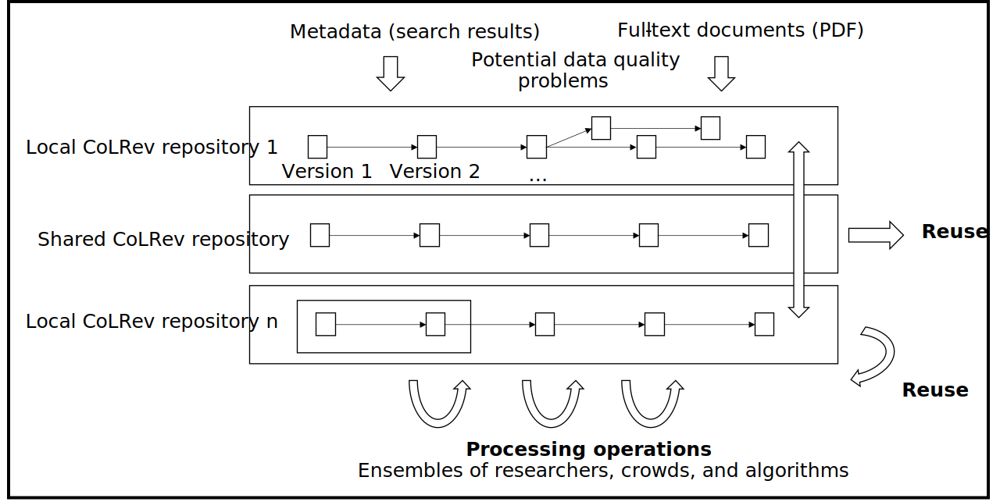
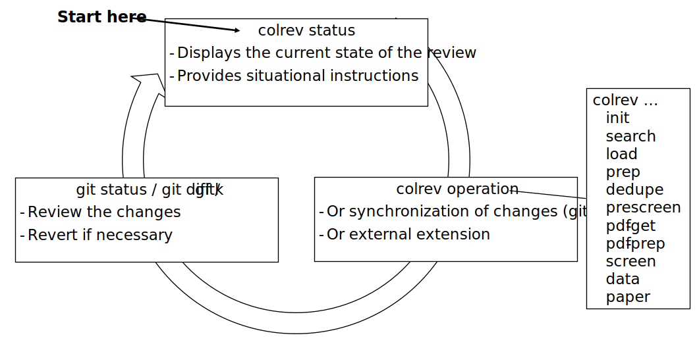
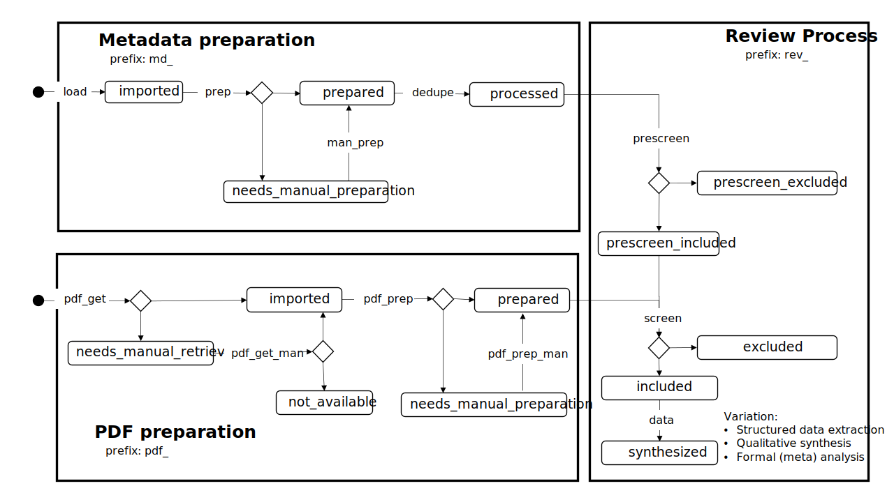
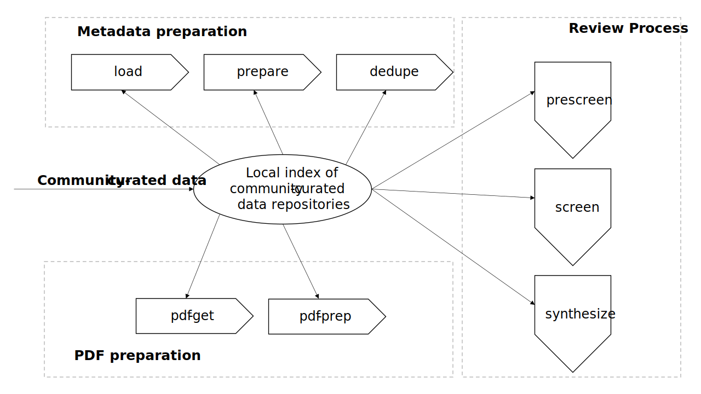

The CoLRev Framework
====================================

The Colaborative Literature Reviews (CoLRev) framework provides a standardized environment, an extensible core engine, and a reference implementation for conducting highly collaborative reviews with a team of researchers and state-of-the-art algorithms.

This document consists of the following sections:

- :any:`definitions`
- :any:`assumptions`
- :any:`architecture`
- :any:`Generic user workflow`
- :any:`Shared model for the steps of the review process`
- :any:`Standardized data structures`
- :any:`Versioning and collaboration principles`
- :any:`Reuse`
- :any:`Guiding principles`

.. _definitions:

Definitions
---------------

A **literature review** is a collaborative process involving researcher-crowd-machine ensembles, which takes records (search results in the form of metadata) and full-text documents as qualitative, semi-structured input to develop a synthesis. The result can take the form of a codified standalone review paper, a published web repository, or a locally curated living review.

.. _assumptions:

Assumptions
------------

Processes generating the metadata, references, full-text documents are inherently decentralized and error prone, and, as a result, each record (metadata or PDF) can have multiple **data quality issues**.
For example, there can be errors in the reference sections of primary papers, in the database indices, or in the machine-readability of PDFs.
As a direct implication, metadata and PDFs, like data in any other research method, require dedicated preparation steps.

There is **variance in how accurately authors, crowds and algorithms perform** (e.g., performance of duplicate detection algorithms or disagreements in the screening process).
As an implication, control of process reliability (and constant improvement of algorithms) is needed, which requires transparency of atomic changes.
As an implication of error-prone data generation processes and variance in processing accuracy, efficient error-tracing and debugging functionality must be built-in.

With ever growing volumes and heterogeneity of research, there is a growing **need to allocate efforts rationally and evidence-based**.
Literature reviews, in their current form, do not effectively leverage data from prior reviews (e.g., in the duplicate detection process, the preparation of metadata and PDFs, or the classification of documents).
As an implication, a clear vision for effectively leveraging evidence and establishing reuse paths (e.g., crowdsourcing) is needed.

Efficient and transparent access to changes is of critical importance to:

- develop confidence in the review process
- communicate and justify the trustworthiness of the results
- improve individual contributions (e.g., train research assistants, to validate algorithms)
- be in a position to identify and remove contributions of individuals (algorithms or researchers) in case systematic errors are introduced
- efficiently extract data on individual steps (e.g., deduplication) for reuse (e.g., crowdsourcing)



.. _architecture:

Architecture
---------------------

CoLRev relies on a modular and extensible platform. It consists of the following components:

- `CoLRev-core`_: a platform engine operating the CoLRev framework and a reference implementation covering each step of the process
- `CoLRev`_: a command-line interface offering convenient and user-friendly access to the reference implementation (see `overview <../guides/overview.html>`_)
- `CoLRev-hooks`_ : a pre-commit hooks allowing the platform engine to validate compliance with CoLRev

Installing the command-line interface automatically installs the CoLRev-core and CoLRev-hooks.
Extensions are available in the `extensions section <resources/extensions.html>`_ and on `Github <https://github.com/topics/colrev-extension>`_.


The **ReviewManager**, as the main interface to the CoLRev engine, supports reviewers in completing the complexity of the review process (e.g., the order of individual steps and their dependencies) in collaborative settings (e.g., requiring synchronization between distributed local repositories).
Essentially, the ReviewManager operates in three modes:

- Autonomous: ReviewManager executes and supervises the process (e.g., loading new records)
- Supervised: ReviewManager is notified before a process is started, usually interactive processes requiring frequent user input (e.g., screening)
- Consulted: ReviewManager is called after files have been modified and checks for consistency (e.g., writing the synthesis)

In addition, the ReviewManager keeps a detailed `report <../guides/changes.html#git-commit-report>`_ of (1) the review environment and parameters (2) the current state of the review, and (3) the individual steps (commands) and the changes applied to the dataset.

.. _Generic user workflow:

Generic user workflow
-------------------------

In its basic form, the workflow consists of iteratively calling ```colrev status``` > ```colrev [process]``` > ```git [process]```
It is self-explanatory with ```colrev status``` recommending the next ```colrev [process]``` or ```git [process]```



.. _Shared model for the steps of the review process:

Shared model for the steps of the review process
-------------------------------------------------------------------

Effectively synchronizing work across teams of researchers, applying algorithms, and incorporating crowd-sourced changes requires a model defining a shared understanding of the review process.
The model is enforced by the platform engine and the command-line interface provides convenience access to the reference implementation.
The overview defines the micro-level steps and situates them in the three macro-level processes of metadata preparation, full-text preparation and the main review process.
Each step can effect a state transition for a record, as recorded in the *status* field.
Key considerations are documented in the guides for the reference implementation.



.. _Standardized data structures:

Standardized data structures
---------------------------------

The CoLRev framework is based on an opinionated and scientifically grounded selection of data structures, file-paths and operating principles.
Ideally, constraining the set of possible data formatting and storage options improves workflow efficiency (because tools and researchers share the same philosophy of data) freeing time and mental energy for literature analysis and synthesis.

The main goal of data structuring is to give users a transparent overview of (1) the detailed changes that were made, (2) by whom, and (3) why.
Examples of transparent changes and a commit report are available in the `changes section <../guides/changes.html>`_.

To accomplish these goals, CoLRev tracks a status for each record (see :any:`Shared model for the steps of the review process`).

- The status is used to determine the current state of the review project
- It is used by the ReviewManager to determine which operations are valid according to the processing order (e.g., records must be prepared before they are considered for duplicate removal, PDFs have to be acquired before the main inclusion screen)
- Tracking record status enables incremental duplicate detection (record pairs that have passed deduplication once do not need to be checked again in the next iterations)
- Strictly adhering to the state machine allows us to rely on a simple data structure (e.g., status="synthesized" implies pdf_prepared, md_prepared, rev_included, rev_prescreen_included - no need to check consistency between different screening decisions)
- An underlying assumption is that different types of reviews share the same process model (with different parameters) and that the main differences are in the data extraction and analysis stages (e.g., requiring structured or unstructured data formats).

Raw data sources

- Major reference formats supported (e.g., RIS, BibTeX, Endnote)
- Transformed to BibTeX by CoLRev to facilitate more efficient processing
- Can be immutable (e.g., results extracted from databases) * Exception: fixing incompatibilities with BibTeX Standard
- Can be in append-mode or even update-mode (e.g., for feeds that regularly query databases or indices like Crossref)

The MAIN_REFERENCES contain all records.
They are considered the "single version of truth" (with the corresponding version history).
They are sorted according to IDs, which makes it easy to examine deduplication decisions. Once propagated to the review process (the prescreen), the ID field (e.g., BaranBerkowicz2021) is considered immutable and used to identify the record throughout the review process.
To facilitate an efficient visual analysis of deduplication decisions (and preparation changes), CoLRev attempts to set the final IDs (based on formatted and completed metadata) when importing records into the MAIN_REFERENCEs (IDs may be updated until the deduplication step if the author and year fields change).

ID formats, such as three-author+year (automatically generated by CoLRev), is recommended because

  - semantic IDs are easier to remember (compared to arbitrary ones like DOIs or numbers that are incremented),
  - global identifiers (like DOIs or Web of Science accession numbers) are not available for every record (such as conference papers, books, or unpublished reports),
  - shorter formats (like first-author+year) may often require arbitrary suffixes

Individual records in the MAIN_REFERENCES are augmented with

- the ```status``` field to track the current state of each record in the review process and to facilitate efficient analyses of changes (without jumping between a references file and a screening sheet/data sheet/manuscript)
- the ```origin``` field to enable traceability and analyses (in both directions)

BibTeX:

- Quasi-standard format that is supported by most reference managers and literature review tools for input/output [1](https://en.wikipedia.org/wiki/Comparison_of_reference_management_software).
- BibTeX is easier for humans to analyze in git-diffs because field names are not abbreviated (this is not the case for Endnote .enl or .ris formats), it is line-based (column-based formats like csv are hard to analyze in git diffs), and it contains less syntactic markup that makes it difficult to read (e.g., XML or MODS).
- BibTeX is easy to edit manually (in contrast to JSON) and does not force users to prepare the whole dataset at a very granular level (like CSL-JSON/YAML, which requires each author name to be split into the first, middle, and last name).
- BibTeX can be augmented (including additional fields for the record origin, status, etc.)
- BibTeX is more flexible (allowing for new record types to be defined) compared to structured formats (e.g., SQL)
- Uppwer/lower-case variations of DOIs are not meaningful because DOIs are `case insensitive <https://www.doi.org/doi_handbook/2_Numbering.html>`_. DOIs are converted to upper case to keep the git history simple.
- Current policy (may change): don't use the crossref field (i.e., resolve it in the preparation). Efficient abbreviation of conference proceedings, can be accomplished through the pandoc `citation abbreviation options <https://pandoc.org/MANUAL.html#option--citation-abbreviations>`_. In addition, the crossreferenced record would not be displayed next to the original record, making it harder to visually validate (preparation) changes. The crossref-fields would also require special treatment in the deduplication process, the retrieval (across repositories) and operations reading records from the disk.
- The order of the first fields is fixed to enable efficient status checks (reading the first n lines of each record instead of parsing the whole file).

.. _CoLRev: https://github.com/geritwagner/colrev
.. _CoLRev-core: https://github.com/geritwagner/colrev_core
.. _CoLRev-hooks: https://github.com/geritwagner/colrev-hooks
.. _CoLRev-extensions: https://github.com/topics/colrev-extension

.. _Versioning and collaboration principles:

Versioning and collaboration principles
--------------------------------------------------

- CoLRev builds on git as the most capable collaborative versioning system currently available.
- Git was originally developed as a distributed versioning system for (software) source code. The collaborative development of software code (semi-structured data) resembles scientific research processes (especially when analyses are implemented in Python or R scripts) and git has been an integral part of the reproducible research movement. A particular strength of git is its capability to merge different versions of a repository.
- Git is used most effectively as line-based versioning of text-files. Visualizing changes is more demanding for structured data (csv) and impossible for binaries (e.g., Word documents).
- A missing element in git-based literature reviews is a "workflow engine" that operates a shared model of the review steps and thereby enables collaboration.
- A commit corresponds to an individual processing step
- Version-history  (explicitly show where flexibility is needed - data extraction/analysis) - also mention git history (principles), commit messages, collaboration principles (local IDs)
- Pre-commit hooks advantage: the versioning system takes care of it (regardless of whether robots or researchers edit the content). We should use the hooks to avoid commits of broken states (untraceable changes). The hooks should exercise relatively strict control because not all authors of a review may be familiar with git/all principles of the review_template. For experts, it is always possible to override the hooks (--no-verify).
- One-branch principle (do not consider branching in the pipeline (yet??))
- Commits should correspond to manual vs. automated contributions. They should reflect the degree to which checking is necessary. For instance, it makes sense to split the merging process into separate commits (the automated/identical ones and the manual ones)
- Git versions should be frequent but also well thought-through and checked/reviewed
- Committed changes should be as small as possible for collaboration/merging purposes (also for checking/restoring)
- Scripts should add their changes to the index

.. _Reuse:

Reuse
--------------------------------------------------

Reuse of community-curated data is a built-in feature of CoLRev, aimed at saving efforts across projects as well as increasing accuracy and richness of the process.
Per default, every CoLRev repository that is registered locally makes its data accessible to all other local repositories.
This means that all general operations (e.g., preparing metadata or linking PDFs) are completed automatically once indexed.
Of course, reuse is the most powerful when curated content (such as reviews, topic or journal-related repositories) is shared within teams or publicly.

CoLRev builds on a comprehensive vision of reusing community-curated data, as illustrated in the figure.
This includes:

- assigning shared IDs in the load process
- curated record metadata in the preparation process
- data on duplicate/non-duplicate relationships
- urls and local paths for PDFs
- fingerprints (hashes) to identify and verify PDFs
- any other label or data associated with the curated records



The colrev_cml_assistant extension provides an environment supporting researchers in curating shared repositories based on crowdsourcing and machine-learning.

.. _Guiding principles:

Guiding principles
---------------------

- Open source software (facilitate competition without lock-in, extensibility)
- Leverage powerful tools and libraries (their ongoing improvements)
- Integration with other tools/environments
- Transparency
- Design for humans (set reasonable defaults that are in line with a systematic approach, make commands and code self-explanatory, human processing time is valuable - prefer supervised execution and correction of algorithms to highly labor-intensive manual editing when algorithm performance is reasonably high, make it easy to identify, trace and correct errors in the project and at source)
