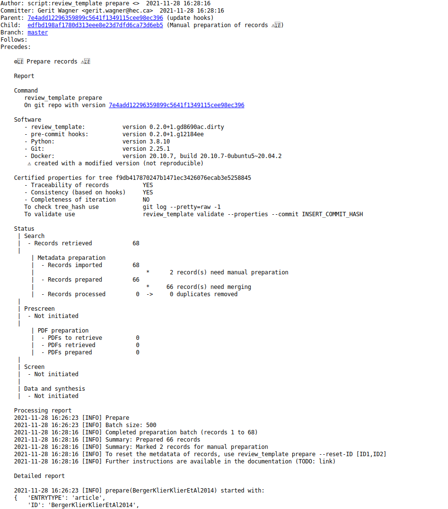

.. _Changes:

Check the changes
==================================

Using a git `client of your choice <https://git-scm.com/downloads/guis>`_, you can validate the individual changes and the commit report for each version.
Instructions on how to correct and trace errors are available in the guidelines for the respective step.

Changes
-------------

CoLRev also ensures that the git-diffs are readable so you can check all changes:

.. figure:: ../../figures/change_example1.png
   :width: 700
   :alt: Changes example

Git commit report
-----------------------



Example of a detailed processing report (last part of the commit report):

.. figure:: ../../figures/change_example2.png
   :alt: Example processing report

Note : in this case, we see that the record was prepared (changing the status from ```md_imported``` to ```md_prepared```) based on the LINKED_URL (as explained by the ```metadata_source``` field).
The doi was extracted from the website (url) and used to update and complete the metadata (after checking whether it corresponds with the existing ```title```, ```author```, .... fields).
