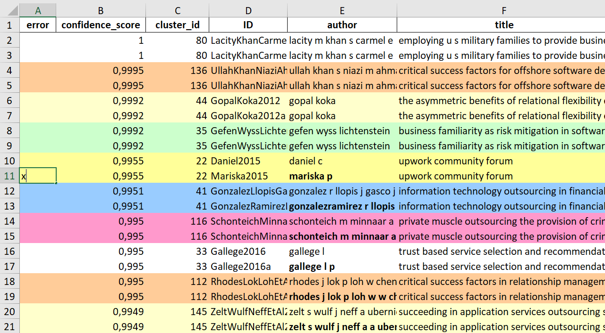

User Documentation
==================================

Workflow:

- :any:`Analyze changes`
- :any:`Curated repositories`

Processing operations:

- :any:`Init`
- :any:`Search`
- :any:`Load`
- :any:`Prepare`
- :any:`Dedupe`
- :any:`Prescreen`
- :any:`PDF get`
- :any:`PDF prep`
- :any:`Screen`
- :any:`Data`
- :any:`Paper`

.. _Analyze changes:

Analyze changes
-------------------------

After each step, check and validate the changes using git status, gitk, and colrev status:

.. code-block:: bash

      git status
      gitk
      colrev status

.. _Curated repositories:

Curated repositories
---------------------------------------------

Literature reviews are much more efficient, accurate, and rich if you rely on curated community repositories (e.g., reuse of prepared metadata, duplicate matchings, PDF hashes).
Search available curations on `Github <https://github.com/topics/colrev-curation>`_, add curated repositories, and to create a reuse-index:

.. code-block:: bash

      colrev local-index add --url https://github.com/u_name/repo_name
      colrev local-index

See `reuse of community-curated data <../framework/colrev.html#reuse>`_ for details.

.. _Init:

Init
---------------------------------------------

:program:`colrev init` initializes a new CoLRev project. It should be called in an empty directory.

.. code:: bash

	colrev init [options]

.. program:: colrev init

.. option:: --name

    Name of the project

.. option:: --curated_metadata

    Use a template for curated metadata repositories.

.. option:: --url

    Url for the curated metadata repository.

Once the repository is set up, you can share it with your team (see `instructions <overview.html#collaborate-in-a-team>`_).

Instead of initializing a new repository, you can also pull an existing one:

.. code:: bash

	git pull https://github.com/u_name/repo_name.git

.. _Search:

Search
---------------------------------------------

:program:`colrev search` retrieves search results from

- Crossref
- DBLP
- CoLRev projects (local or online)
- Directories containing PDFs
- Curated metadata repositories (through the local index)

.. code:: bash

	colrev search [options]

.. option:: --add TEXT

    Add a new search query.

.. code:: bash

    Examples:

    colrev search -a "RETRIEVE * FROM crossref, dblp WHERE Digital AND Platform SCOPE journal_issn='1506-2941'"

    colrev search -a "RETRIEVE * FROM dblp SCOPE venue_key='journals/dss' AND journal_abbreviation='Decis. Support Syst.'"

    colrev search -a "RETRIEVE * FROM project SCOPE url='/home/projects/review9'"

    colrev search -a "RETRIEVE * FROM backward_search"

    colrev search -a "RETRIEVE * FROM index WHERE lower(fulltext) like '%digital platform%'"

    colrev search -a "RETRIEVE * FROM pdfs_directory SCOPE path='/home/journals/PLOS' WITH sub_dir_pattern='volume_number' AND journal='PLOS One'"

.. option:: --selected TEXT

    Run selected search

.. _Load:

Load
---------------------------------------------

:program:`colrev load` loads search results as follows:

- Save file in `search/`.
- Check that the extension corresponds to the file format (see below)
- Run`colrev load`, which
    - asks for details on the source (records them in sources.yaml)
    - converts search files (with supported formats) to BiBTex
    - unifies field names (in line with the source)
    - creates an origin link for each record
    - imports the records into the references.bib

.. code:: bash

	colrev load [options]

.. program: colrev load

.. option:: --keep_ids, -k

    Do not change the record IDs. Useful when importing an existing sample.

.. option:: --add_colrev_repo PATH

    Path to a CoLRev repo that should be imported.

.. option:: ----update_colrev_repo_sources

    Update records from CoLRev repos.

Formats

- Structured formats (csv, xlsx) are imported using standard Python libraries
- Semi-structured formats are imported using bibtexparser or the zotero-translation services (see `supported import formats <https://www.zotero.org/support/kb/importing_standardized_formats>`_)
- Unstructured formats are imported using Grobid (lists of references and pdf reference lists)

.. _Prepare:

Prepare
---------------------------------------------

:program:`colrev prep` prepares the metadata. It completes the following steps:

- format fields and drop selected fields (such as broken urls)
- automatically exclude records with non-latin alphabets
- retrieve DOI identifier and metadata from online repositories (e.g., crossref, semantic scholar, DBLP, open library )
- heuristic metadata imrovements

After completion, it creates new local IDs for records that were processed

Operating assumptions and principles:

- Every source of metadata has errors
- Focus efforts on those sources that have the most errors (e.g., GoogleScholar)
- Have errors corrected (see last section)

.. code:: bash

	colrev prep [options]

.. program:: colrev prep

.. option:: --similarity

    Retrieval similarity threshold

.. option:: --reprocess

	Prepare all records with status md_needs_manual_preparation

.. option:: --keep_ids

	Do not change the record IDs. Useful when importing an existing sample.

.. option:: --reset_records ID1,ID2,ID3

    Reset record metadata of records ID1,ID2,ID3 to the imported version.

.. option:: --reset_ids

    Reset IDs that have been changed (to fix the sort order in MAIN_REFERENCES)

.. option:: --set_ids

    Generate and set IDs

.. option:: --update

    Update metadata (based on DOIs)

.. option:: --polish

    Polish the metadata without changing the record status.

    Based on the enhanced TEIs, it conducts a frequency analysis of the reference sections and checks how included and synthesized papers are cited.
    Titles and journals are set to the most frequent values.

.. option:: --debug ID

    Debug the preparation process to identify, trace and correct potential errors.

When records cannot be prepared automatically, we recommend opening the references.bib with a reference manager (such as Jabref) and preparing the remaining records manually. For example, JabRef allows you to filter records for the *needs_manual_preparation* status:

.. figure:: ../../figures/man_prep_jabref.png
   :alt: Manual preparation with Jabref

Note: after preparing the records, simply run :program:`colrev status`, which will update the status field and formatting according to the CoLRev standard.

In addition, :program:`colrev prep-man` provides an interactive convenience function.

.. code:: bash

	colrev pdf-prep-man [options]

.. option:: --extract

    Extract records for manual_preparation (to csv)

.. option:: --apply

    Apply manual preparation (csv)

.. option:: --stats

    Print statistics of records with status md_needs_manual_preparation

Tracing and correcting errors

To trace an error (e.g., incorrect author names)

- use a git client to identify the commit in which the error was introduced (e.g., using gitk: right-click on the line and select *show origin of this line*, or navigate to *blame* on Github)
- identify the ID of the record and search for it in the commit message for further details

If the error was introduced in a 'prep' commit, the commit message will guide you to the source.

.. _Dedupe:

Dedupe
---------------------------------------------

:program:`colrev dedupe` identifies and merges duplicates as follows:

- In an active learning process (based on the `dedupeio <https://github.com/dedupeio/dedupe>`_ library), researchers are asked to label pairs of papers
- Once enough pairs have been labeled (e.g., at least 50 duplicates and 50 non-duplicates), the remaining records are matched and merged automatically
- To validate the results, spreadsheets are exported in which duplicate and non-duplicate pairs can be checked (taking into consideration the differences in metadata and the confidence provided by the classifier)
- Corrections can be applied by marking pairs in the spreasheet ("x" in the *error* column), saving the file, and running colrev dedupe -f

.. code:: bash

	colrev dedupe [options]

.. option:: --fix_errors

    Load errors as highlighted in the spreadsheets (duplicates_to_validate.xlsx, non_duplicates_to_validate.xlsx) and fix them.

.. option:: --retrain

    Retrain the duplicate classifier (removing the training data and the model settings).

.. _Prescreen:

Pre-screen
---------------------------------------------

:program:`colrev prescreen` supports interactive prescreening

.. code:: bash

	colrev prescreen [options]

.. option:: --include_all

    Include all papers (do not implement a formal prescreen)

.. _PDF get:

PDF get
---------------------------------------------

:program:`colrev pdf-get` retrieves PDFs based on

- unpaywall.org
- any other local CoLRev repository

This may retrieve up to 80 or 90% of the PDFs, especially when larger PDF collections are stored locally and when multiple authors use :program:`colrev pdf-get` to collect PDFs from their local machines.
When PDFs cannot be retrieved automatically, CoLRev provides an interactive convenience function :program:`colrev pdf-get-man`.

.. code:: bash

	colrev pdf-get [options]

.. option:: --copy-to-repo

    Copy PDFs to the repository (otherwise, links are created, but PDFs remain in their original locations)

.. option:: --rename

    Automatically rename PDFs (to their local IDs)

.. option:: --relink_files ID1,ID2

    Search for the PDF (based on the pdf_hash) and update the file link accordingly. Useful when PDFs are renamed or moved to subdirectories.

:program:`colrev pdf-get-man` goes through the list of missing PDFs and asks the researcher to retrieve it:

- when the PDF is available, name it as ID.pdf (based on the ID displayed) and move it to the pdfs directory
- if it is not available, simply enter "n" to mark it as *not_available* and continue

.. code:: bash

	colrev pdf-get-man [options]

.. _PDF prep:

PDF prep
---------------------------------------------

:program:`colrev pdf-prep` prepares PDFs for the screenand analysis as follows:

- Check whether the PDF is machine readable and apply OCR if necessary
- Identify and remove additional pages and decorations (may interfere with machine learning tools)
- Validate whether the PDF matches the record metadata and whether the PDF is complete (matches the number of pages)
- Create unique PDF identifiers (pdf hashes) that can be used for retrieval and validation (e.g., in crowdsourcing)

.. code:: bash

	colrev pdf-prep [options]

.. option:: --update_hashes

    Regenerate pdf_hashes

.. option:: --reprocess

    Prepare all PDFs again (pdf_needs_manual_preparation)

..
	--get_hashes : a convenience function

When PDFs cannot be prepared automatically, :program:`colrev pdf-prep-man` provides an interactive convenience function.

.. code:: bash

	colrev pdf-prep-man [options]

.. option:: --stats

    Print statistics of records with status pdf_needs_manual_preparation

.. _Screen:

Screen
---------------------------------------------

:program:`colrev screen` supports interactive screening based on a list of exclusion criteria

.. code:: bash

	colrev screen [options]

.. option:: --include_all

    Include all papers

.. _Data:

Data
---------------------------------------------

:program:`colrev data` supports the data extraction, analysis and synthesis. Depending on the type of review, this may involve

- a manuscript-based synthesis
- structured data extraction

To select the data format, please consult the best practices for different `types of reviews <../guides/best_practices.html#types-of-literature-reviews>`_.

To set the data format, run

.. code:: bash

    # Note: the format can be a list, possible values:
    # MANUSCRIPT, TEI
    colrev config --set DATA_FORMAT=['MANUSCRIPT']

    # commit changes:
    git add shared_config.ini
    git commit -m 'update data format'

Depending on the data format, the :program:`colrev data` command

- adds new records to the manuscript (paper.md, after the <!-- NEW_RECORD_SOURCE --> marker)
- creates (enhanced) TEI files
- **to be implemented**: adds new records to the coding sheets for structured data extraction and analysis

.. code:: bash

	colrev data [options]

.. option:: --profile

    Generate a sample profile.

.. option:: --enlit

    Calculate ENLIT heuristic (intra-corpus influence) to prioritize reading (see [WagnerEtAl2020]_).

..
    copy-pdfs: a convenience function

.. _Paper:

Paper
---------------------------------------------

:program:`colrev paper` builds the final paper (e.g., PDF, Word) from the markdown document paper.md using `pandoc <https://github.com/jgm/pandoc>`_.

.. code:: bash

	colrev paper [options]

Links and references for standalone literature reviews are available in the `best practices <../resources/best_practices.html>`_ section.

References
--------------

.. [WagnerEtAl2020] Wagner, G. and Empl, P. and Schryen, G. (2020). Designing a novel strategy for exploring literature corpora. Proceedings of the European Conference on Information Sytems.
