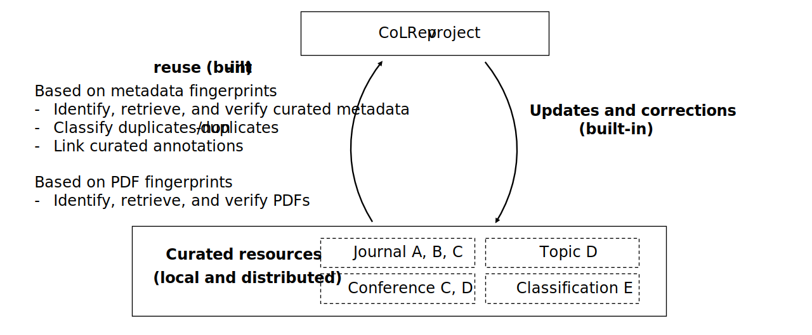

Collaborative Literature Reviews
========================================

CoLRev (Collaborative Literature Reviews) aims at facilitating highly collaborative literature reviews involving teams of researchers, state-of-the-art algorithms, and content curated by the research community.
The core proposition is that the transparent collaboration model of git, combined with a robust content-based identification scheme, and a content curation model can enable literature review processes that are more trustworthy, more efficient, and richer.

Getting started
-----------------

After `installing CoLRev <guides/user_documentation.html#installation>`_, use the command-line interface by running

.. code-block::

   colrev status

The status command displays the current state of the review and guides you to the next steps (see `CoLRev operations <guides/user_documentation.html>`_).
After each step, make sure to `check the changes <guides/user_documentation.html#analyze-changes>`_, effectively following a three-step cycle:

.. figure:: ../figures/workflow-cycle.svg
   :width: 700
   :alt: Workflow cycle

Conducting a full literature review should be as simple as running the following commands (each one followed by `git status`/`gitk` and `colrev status`):

.. code-block:: bash

      # Initialize the project
      colrev init

      colrev search --add "RETRIEVE * FROM crossref WHERE digital"
      # Or store search results in the search directory

      # Load the seach results
      colrev load

      # Prepare the metadata
      colrev prep

      # Identify and merge duplicates
      colrev dedupe

      # Conduct a prescreen
      colrev prescreen

      # Get the PDFs for included papers
      colrev pdf-get

      # Prepare the PDFs
      colrev pdf-prep

      # Conduct a screen (using specific criteria)
      colrev screen

      # Complete the data analysis/synthesis
      colrev data

      # Build the paper
      colrev paper

A key feature of CoLRev is that reuse of community-curated data is built into each step:

For (CoLRev) curated data, the prep/dedupe/pdf-get/pdf-prep steps are not needed (or simplified).
When most records are curated, a CoLRev literature review can focus on the search, prescreen/screen and synthesis.

Further details are provided in the `user documentation <guides/user_documentation.html>`_.

.. toctree::
   :hidden:
   :maxdepth: 2
   :caption: Contents:

.. toctree::
   :hidden:
   :maxdepth: 1
   :caption: Guidelines

   guides/user_documentation
   guides/extensions
   guides/best_practices

.. toctree::
   :hidden:
   :caption: Technical documentation
   :maxdepth: 1

   technical_documentation/colrev
   Contribution guide <https://github.com/geritwagner/colrev_core/blob/main/CONTRIBUTING.md>
   Github repository <https://github.com/geritwagner/colrev_core>
   technical_documentation/extension_development
   technical_documentation/roadmap
   technical_documentation/about
