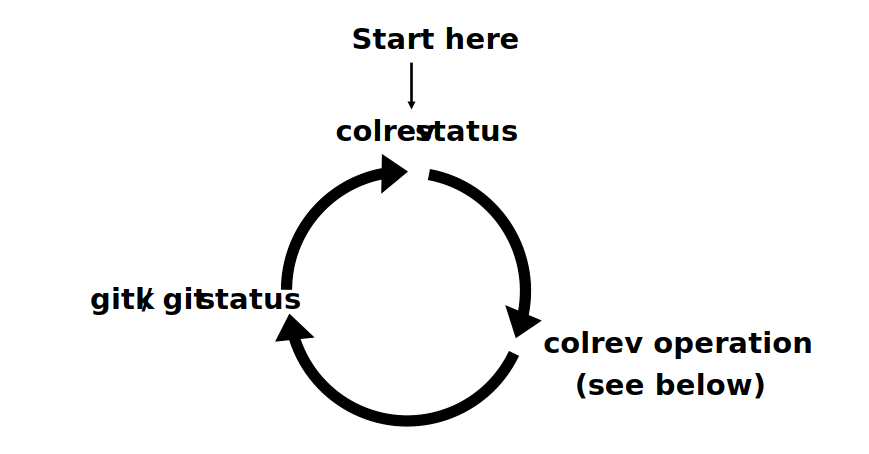

Collaborative Literature Reviews
========================================

This project aims at improving the literature review process in terms of efficiency, trustworthiness, and richness.
To accomplish this, CoLRev combines the transparent collaboration model of git with robust content-based identification schemes, and a model for content curation and reuse.

Getting started
-----------------

After `installing CoLRev <guides/documentation.html#installation>`_, use the command-line interface

.. code-block::

   colrev status

The status command displays the current state of the review and guides you to the next steps (see `CoLRev operations <guides/documentation.html>`_).
After each step, make sure to `check the changes <guides/documentation.html#analyze-changes>`_, effectively following a three-step cycle:

Conducting a literature review should be as simple as running the following operations (each one followed by `gitk`/`git status` and `colrev status`):

.. code-block:: bash

      # Initialize the project
      colrev init

      colrev search --add "FROM crossref WHERE digital"
      # Or store search results in the search directory

      # Load the search results
      colrev load

      # Prepare the metadata
      colrev prep

      # Identify and merge duplicates
      colrev dedupe

      # Conduct a prescreen
      colrev prescreen

      # Get the PDFs for included papers
      colrev pdf-get

      # Prepare the PDFs
      colrev pdf-prep

      # Conduct a screen (using specific criteria)
      colrev screen

      # Complete the data analysis/synthesis
      colrev data

      # Build a draft of the paper
      colrev paper

A key feature of CoLRev is that reuse of community-curated data is built into each step:

.. figure:: ../figures/reuse-vision.svg
   :width: 800
   :alt: Reuse vision

For CoLRev curated data, the efforts required for the preparation steps is reduced significantly.
The more records are curated, the more you can focus on the search, prescreen/screen and synthesis.
Further details are provided in the `documentation <guides/documentation.html>`_.

Credits
-----------------

The broader vision is better tool-support for the literature review process. To achieve this, CoLRev adopts **batteries included but swappable** as a principle to reconcile the need for an efficient end-to-end process with the possibility to select and combine specific tools. Users can -- for each step of the review process -- select custom tools or rely on the powerful reference implementation of CoLRev.

The CoLRev reference implementation builds on the shoulders of amazing projects (growing giants) and benefits from their ongoing improvements

.. |gitactivity| image:: https://img.shields.io/github/commit-activity/y/git/git?color=green&style=plastic
   :height: 12pt

.. |precommitactivity| image:: https://img.shields.io/github/commit-activity/y/pre-commit/pre-commit?color=green&style=plastic
   :height: 12pt

.. |dockerpyactivity| image:: https://img.shields.io/github/commit-activity/y/docker/docker-py?color=green&style=plastic
   :height: 12pt

.. |dedupeioactivity| image:: https://img.shields.io/github/commit-activity/y/dedupeio/dedupe?color=green&style=plastic
   :height: 12pt

.. |pandasactivity| image:: https://img.shields.io/github/commit-activity/y/pandas-dev/pandas?color=green&style=plastic
   :height: 12pt

.. |pdfmineractivity| image:: https://img.shields.io/github/commit-activity/y/pdfminer/pdfminer.six?color=green&style=plastic
   :height: 12pt

.. |zoterotranslatoractivity| image:: https://img.shields.io/github/commit-activity/y/zotero/translators?color=green&style=plastic
   :height: 12pt

.. |ocrmypdfactivity| image:: https://img.shields.io/github/commit-activity/y/jbarlow83/OCRmyPDF?color=green&style=plastic
   :height: 12pt

.. |tesseractactivity| image:: https://img.shields.io/github/commit-activity/y/tesseract-ocr/tesseract?color=green&style=plastic
   :height: 12pt

.. |grobidactivity| image:: https://img.shields.io/github/commit-activity/y/kermitt2/grobid?color=green&style=plastic
   :height: 12pt

.. |pandocactivity| image:: https://img.shields.io/github/commit-activity/y/jgm/pandoc?color=green&style=plastic
   :height: 12pt

.. |cslactivity| image:: https://img.shields.io/github/commit-activity/y/citation-style-language/styles?color=green&style=plastic
   :height: 12pt

.. |elasticsearchactivity| image:: https://img.shields.io/github/commit-activity/y/elastic/elasticsearch?color=green&style=plastic
   :height: 12pt

.. list-table::
   :widths: 54 24 22
   :header-rows: 1

   * - Project and functionality
     - License
     - Activity
   * - `git <https://github.com/git/git>`_ \*: versioning and collaboration
     - `GPL 2 <https://github.com/git/git/blob/master/COPYING>`_
     - |gitactivity|
   * - `pre-commit <https://github.com/pre-commit/pre-commit>`_ : checks and reports
     - `MIT <https://github.com/pre-commit/pre-commit/blob/master/LICENSE>`_
     - |precommitactivity|
   * - `docker-py <https://github.com/docker/docker-py>`_ : accessing microservices
     - `Apache-2.0 <https://github.com/docker/docker-py/blob/master/LICENSE>`_
     - |dockerpyactivity|
   * - `pandas <https://github.com/pandas-dev/pandas>`_ for record management
     - `BSD 3 <https://github.com/pandas-dev/pandas/blob/master/LICENSE>`_
     - |pandasactivity|
   * - `Zotero translators <https://github.com/zotero/translators>`_ \*: record import
     - `GPL <https://github.com/zotero/translators/blob/master/COPYING>`_
     - |zoterotranslatoractivity|
   * - `PDFMiner.six <https://github.com/pdfminer/pdfminer.six>`_ : PDF management
     - `MIT <https://github.com/pdfminer/pdfminer.six/blob/develop/LICENSE>`_
     - |pdfmineractivity|
   * - `OCRmyPDF <https://github.com/jbarlow83/OCRmyPDF>`_ \*: OCR tasks
     - `MPL-2.0 <https://github.com/jbarlow83/OCRmyPDF/blob/master/LICENSE>`_
     - |ocrmypdfactivity|
   * - `Tesseract OCR <https://github.com/tesseract-ocr/tesseract>`_ \*: OCR tasks
     - `Apache-2.0 <https://github.com/tesseract-ocr/tesseract/blob/main/LICENSE>`_
     - |tesseractactivity|
   * - `GROBID <https://github.com/kermitt2/grobid>`_ \*: parsing annotated PDF content
     - `Apache 2.0 <https://github.com/kermitt2/grobid/blob/master/LICENSE>`_
     - |grobidactivity|
   * - `dedupe <https://github.com/dedupeio/dedupe>`_ : duplicate identification
     - `MIT <https://github.com/dedupeio/dedupe/blob/master/LICENSE>`_
     - |dedupeioactivity|
   * - `pandoc <https://github.com/jgm/pandoc>`_ \*: creating manuscripts
     - `GPL 2 <https://github.com/jgm/pandoc/blob/master/COPYRIGHT>`_
     - |pandocactivity|
   * - `CSL <https://github.com/citation-style-language/styles>`_ \*: formatting citations
     - `CC BY-SA 3.0 <https://github.com/citation-style-language/styles>`_
     - |cslactivity|
   * - `Elasticsearch <https://github.com/elastic/elasticsearch>`_ \*: searching local projects
     - `multiple <https://github.com/elastic/elasticsearch/blob/master/LICENSE.txt>`_
     - |elasticsearchactivity|

\* dynamically loaded

.. list-table:: Sources for metadata preparation and PDF retrieval
   :widths: 54 24 22
   :header-rows: 1

   * - Source (type)
     - Field
     - Size
   * - `Crossref <https://www.crossref.org/>`_ (curated metadata)
     - Cross-discipline
     - > 125,000,000
   * - `Semantic Scholar <https://www.semanticscholar.org/>`_ (metadata)
     - Cross-discipline
     - > 175,000,000
   * - `dblp <https://dblp.org/>`_ (curated metadata)
     - IT/IS
     - > 5,750,000
   * - `Open Library <https://openlibrary.org/>`_ (curated metadata, books)
     - Cross-discipline
     - > 20,000,000
   * - `Unpaywall <https://unpaywall.org/>`_ (legal/OA PDF retrieval)
     - Cross-discipline
     - > 30,000,000

How to cite
-----------------

Please refer to the present GitHub project:

.. code-block:: BibTeX

   @misc{colrev,
   author = {Wagner, G. and Prester, J.},
   title = {CoLRev - A Framework for Colaborative Literature Reviews},
   howpublished = {\url{https://github.com/geritwagner/colrev_core}},
   publisher = {GitHub},
   year = {2022},
   }

.. toctree::
   :hidden:
   :maxdepth: 2
   :caption: Contents:

.. toctree::
   :hidden:
   :maxdepth: 1
   :caption: Guidelines

   guides/documentation
   guides/extensions
   guides/best_practices

.. toctree::
   :hidden:
   :caption: Technical documentation
   :maxdepth: 1

   technical_documentation/colrev
   Contribution guide <https://github.com/geritwagner/colrev_core/blob/main/CONTRIBUTING.md>
   GitHub repository <https://github.com/geritwagner/colrev_core>
   technical_documentation/extension_development
   technical_documentation/roadmap
   technical_documentation/about
