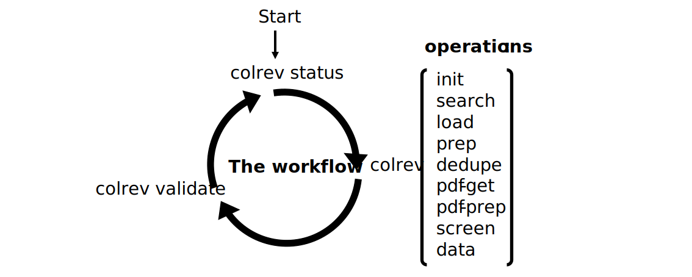

Collaborative Literature Reviews
========================================

.. figure:: https://raw.githubusercontent.com/CoLRev-Ecosystem/colrev/main/docs/figures/logo_small.png
   :width: 400
   :align: center
   :alt: Logo

CoLRev is an open-source environment for collaborative literature reviews. It takes care of the data, integrates with differerent synthesis tools, and facilitates Git-based collaboration.

To accomplish these goals, CoLRev advances the design of review technology at the intersection of methods, design, cognition, and community building.
The following features stand out:

- An open and extensible environment based on data and process standards
- Builds on git and its transparent collaboration model for the entire literature review process
- Offers a self-explanatory, fault-tolerant, and configurable user workflow
- Operates a model for data quality, record identification, content curation, and reuse
- Enables typological and methodological pluralism throughout the process (`in-progress <https://github.com/CoLRev-Ecosystem/colrev/issues/110>`_)

Getting started
---------------------------------------

After installing `git <https://git-scm.com/>`_ and `docker <https://www.docker.com/>`_ (Docker is optional but recommended):

.. code-block::

   # Install
   pip install colrev

   # ... and start with the main command
   colrev status

**The workflow** consists of three steps. This is all you need to remember. The status command displays the current state of the review and guides you to the next `operation <manual/operations.html>`_.
After each operation, `validate the changes <manual/workflow.html#colrev-validate>`_.

**The operations** allow you to complete a literature review. It should be as simple as running the following commands:

.. code-block::

   # Initialize the project, formulate the objectives, specify the review type
   colrev init

   # Store search results in the data/search directory
   # Load, prepare, and deduplicate the metadata reocrds
   colrev retrieve

   # Conduct a prescreen
   colrev prescreen

   # Get and prepare the PDFs
   colrev pdfs

   # Conduct a screen based on PDFs
   colrev screen

   # Complete the forms of data analysis and synthesis, as specified in the settings
   colrev data

For each operation, the **colrev settings** document the tools and parameters. You can rely on the built-in reference implementation of colrev, specify external tools, or include custom scripts. The settings are adapted to the type of review and suggest reasonable defaults. You have the option to customize and adapt.

.. figure:: https://raw.githubusercontent.com/CoLRev-Ecosystem/colrev/51b566b6a2fffedda1a5ab5df14a0f387326460b/docs/figures/settings.svg
   :width: 600
   :align: center
   :alt: Settings

**The project collaboration loop** allows you to synchronize the project repository with your team.
The ``colrev pull`` and ``colrev push`` operations make it easy to collaborate on a specific project while reusing and updating record data from multiple curated repositories.
In essence, a CoLRev repository is a git repository that follows the CoLRev data standard and is augmented with a record-level curation loop.

**The record curation loop** proposes a new vision for the review process.
Reuse of community-curated data from different sources is built into each operation.
It can substantially reduce required efforts and improve richness, e.g., through annotations of methods, theories, and findings.
The more records are curated, the more you can focus on the synthesis.

.. figure:: https://raw.githubusercontent.com/CoLRev-Ecosystem/colrev/51b566b6a2fffedda1a5ab5df14a0f387326460b/docs/figures/reuse-vision_loop.svg
   :width: 800
   :align: center
   :alt: Reuse vision

Further information is provided in the `documentation <index.html>`_, the developer `API reference <foundations/api.html>`_, and the `CoLRev framework <foundations/colrev.html>`_ summarizing the scientific foundations.

.. toctree::
   :hidden:
   :maxdepth: 2
   :caption: Contents:

.. toctree::
   :hidden:
   :maxdepth: 2
   :caption: Manual

   Introduction <manual/manual>
   manual/operations
   manual/workflow
   manual/problem_formulation
   manual/metadata_retrieval
   manual/metadata_prescreen
   manual/pdf_retrieval
   manual/pdf_screen
   manual/data
   manual/collaboration
   manual/curation
   manual/extensions
   manual/reference_manager
   manual/credits
   manual/help

.. toctree::
   :hidden:
   :caption: Documentation and governance
   :maxdepth: 1

   foundations/colrev
   foundations/api
   foundations/cli
   foundations/extensions
   foundations/roadmap
   foundations/about

.. toctree::
   :hidden:
   :caption: Links
   :maxdepth: 1

   Github repository <https://github.com/CoLRev-Ecosystem/colrev>
   PyPI <https://pypi.org/project/colrev/>
