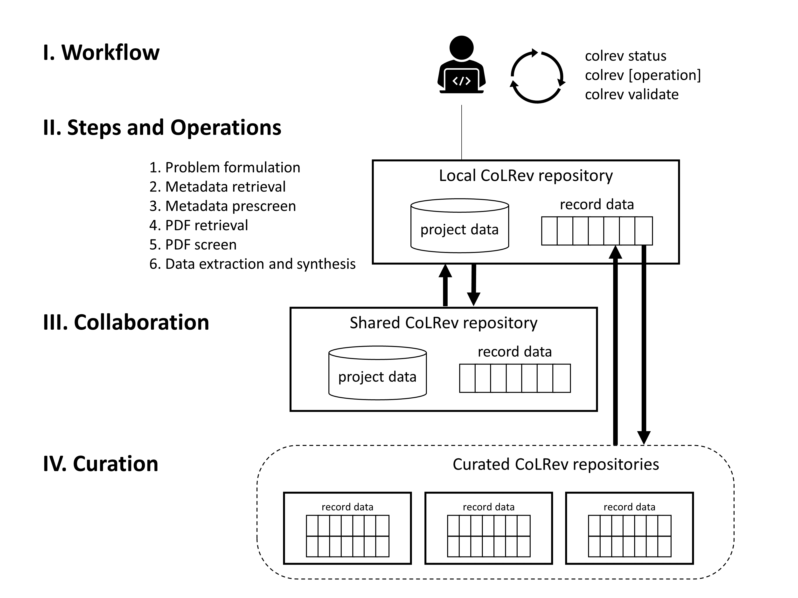

Literature reviews with CoLRev
==================================

.. figure:: ../../figures/logo_small.png
    :align: right
    :figwidth: 300px

The manual explains how to use the functionality of CoLRev when conducting a literature review. It covers the user workflow, the processing operations, as well as collaboration and curation.
It does not explain the design and architecture of CoLRev, which are covered in the `technical documentation <../foundations/colrev.html>`_ and the `API reference <../foundations/api.html>`_.
Our goal is to provide a manual that is self-contained. Yet, it can help to be familiar with the basics of git - for example, by catching up with one of the interactive and free tutorials available online (`tutorial <https://learngitbranching.js.org/>`_).

.. TODO : elaborate on prerequisites?

**Installation**

CoLRev is implemented in Python and should be compatible with Windows, MacOS, and Linux.
After installing `git <https://git-scm.com/>`_ and `docker <https://www.docker.com/>`_:

.. code-block::

   # Install
   pip install colrev

Docker is optional but recommended. It efficiently runs containers that would otherwise require complex setup and configuration (such as GROBID, Zotero translators, Pandoc, OCRMyPDF, bibutils).

On MacOS, it may be necessary to start the Docker Desktop Daemon manually.

To run CoLRev without Docker, CoLRev automatically detects whether Docker is available and suggests to setup repositories with the ``light`` option (``colrev init --light``).

Installing the command-line interface automatically installs the CoLRev-core and CoLRev-hooks.
On Windows, Docker must be started before using CoLRev. This can be done manually or automatically based on the settings (general/start Docker Desktop when you log in).

..
    Extensions are available in the `extensions section <manual/extensions.html>`_ and on `GitHub <https://github.com/topics/colrev-extension>`_.

**Python venv**

It is recommended to run CoLRev in a virtual environment.
CoLRev relies on several fixed-version dependencies for reproducibility and venv helps to avoid dependency conflicts with other packages.

.. TODO : at some point, we may start to include links to other resources/tutorials/workshops

.. code-block::

    # To create
    python -m venv myvenv

    # To activate (Linux)
    source myvenv/bin/activate

    # To activate (Windows)
    myenv\Scripts\activate.bat

The manual is available under the `Creative Commons Attribution-NonCommercial-NoDerivs 3.0 License <https://creativecommons.org/licenses/by-nc-nd/3.0/us/>`_ and endorses the `Code of Conduct <https://www.contributor-covenant.org/version/2/0/code_of_conduct/>`_ for contributions.
