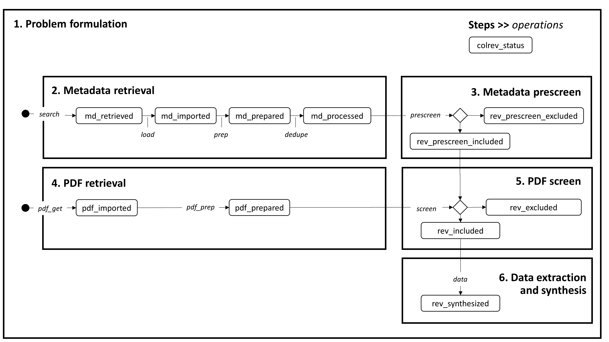

Steps and operations
==================================

CoLRev is based on a shared model of six methodological **steps** of the literature review process:

1. Problem formulation
2. Metadata retrieval
3. Metadata prescreen
4. PDF retrieval
5. PDF screen
6. Data extraction and synthesis

These steps, which typically involve iterations, are operationalized through operations as displayed in the figure:

**Operations** are a core element of CoLRev.
An operation can lead to a state transition of records (as illustrated in the figure) or not (e.g., the ``colrev init`` or ``colrev status`` operations do not lead to state transitions).
As an example of a state transition the ``prescreen`` operation leads records to transition from the ``md_processed`` state to the ``prescreen_excluded`` or ``prescreen_included`` state.

The steps and operations provide a shared basis that applies across the different types of reviews.
The operations are adapted to the type of review based on parameters and extensible functionality.
For example, the data operation may involve structured data extraction or a narrative synthesis.

..
   The sequence of steps and operations as well as the corresponding state transitions of records are standardized across CoLRev projects.
   Within this standardized structure, each operation can be configured.
   Through the settings, it is possible to rely on the default configuration (the CoLRev reference implementation with reasonable parameters), to adapt selected parameters, to plug in CoLRev packages (community packages or custom built ones).

There are two **quality models**, one for :doc:`metadata </resources/quality_model>` and one for :doc:`PDF documents </resources/pdf_quality_model>`. If records or PDFs do not pass the corresponding checks, they are marked for manual preparation.

.. collapse:: References

   **Generic steps for different types of literature reviews**

   Templier, M., & Pare, G. (2018). Transparency in literature reviews: an assessment of reporting practices across review types and genres in top IS journals. European Journal of Information Systems, 27(5), 503-550. `link <https://www.tandfonline.com/doi/full/10.1080/0960085X.2017.1398880?casa_token=YiDmhtUaZMwAAAAA%3AZBMoz4ANiiELS92eIdQhYhLp4dPKNTG43Uj-tT8Kh1nE2f6noBiT9L780h12e9PP-djXBKwC6B8a>`_
