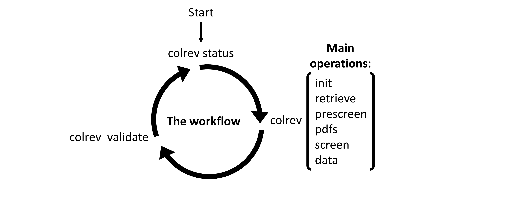
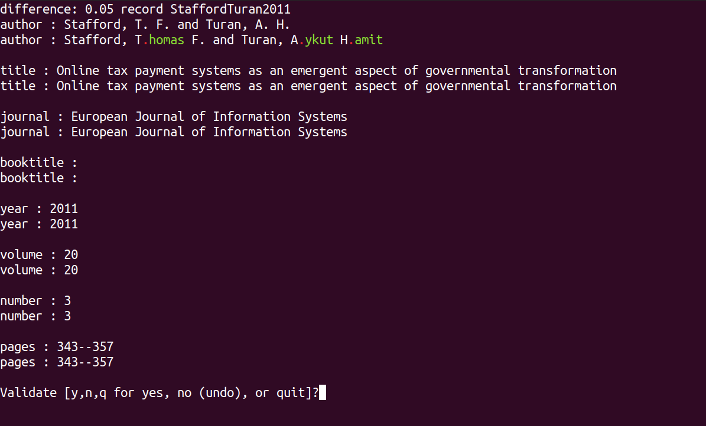

Workflow
==================================

The three-step **workflow** is designed as an intuitive cognitive tool for users to navigate the literature review process.
Repeatedly calling ``colrev status`` should guide you through the different steps and operations, help you to keep track of individual papers, use different tools, and collaborate with the team.

..
   Mention agreement on a shared data structure and steps of the literature review
   This chapter will teach you how to use the CoLRev workflow.
   In CoLRev, you should only have to know the colrev status command and ...

.. The main purpose of the three-step workflow is to make your work easier.

The workflow, as illustrated in the following, consists of a three-step cycle that iterates from ``colrev status`` to a ``colrev [operation]`` to ``colrev validate`` and back to ``colrev status``:

Although the validation step is generally recommended, it is more important for some operations than for others.
For operations like ``init``, or operations that do not create new versions (such as ``push`` or ``show``), the validation can be skipped.

The use of CoLRev operations ensures that the data is always formated consistently and that diffs are readable.
It is also possible to create versions through git commands, which automatically trigger CoLRev's pre-commit hooks.

CoLRev status
-------------------------------

The ``colrev status`` command serves as a starting point for all steps and helps to make CoLRev self-explanatory.
It consists of the following (as shown below):

.. code-block:: bash

   Status

    Metadata retrieval        7040 processed    [6198 curated]
    Metadata prescreen         814 included     [6226 prescreen excluded]
    PDF retrieval              814 prepared
    PDF screen                  49 included     [716 excluded]
    Data synthesis              49 synthesized

   Next operation
     colrev dedupe

   For more details: colrev status -v

- The **status** section, which provides an overview of the review project and reports the state of the records in the process

- The **next operation** section, which provides situational instructions on the next steps of the review project (highlighted in yellow), versioning and collaboration, and the local CoLRev environment

In the background, ``colrev status`` also checks consistency of file formats and structure.
Like all other operations, it also offers the possibility to display more detailed information (simply add ``-v``).

CoLRev operation
-------------------------------

The methodological steps of the literature review are completed through the CoLRev operations (as illustrated :doc:`earlier </manual/operations>`).
Once completed, operations can create new commits (versions).
Detailed information on the steps and operations are provided on the following pages.

CoLRev validate
-------------------------------

After each step, you can check and validate the changes using:

.. code-block:: bash

      colrev validate .

This operation displays the most substantial changes for the selected commit and allows users to undo selected changes efficiently.
The following figure illustrates the validation for a ``prep`` operation:

``validate`` is a general operation that allows users to validate changes in different types of commits (``prep``, ``dedupe``, ...),
but also changes of particular users, properties of the review or other (see `cli-reference/validate <cli reference>`).
For some operations (such as ``prep`` and ``dedupe``), CoLRev provides custom validation functionality, which displays the most substantial changes first.
In other cases, CoLRev opens gitk, which displays all committed changes.
If necessary, whole versions can be undone through git clients (for an overview of git GUI clients, see `here <https://git-scm.com/downloads/guis>`_).

It is also possible to ``validate`` previous versions.
This could be done to ``validate`` the changes introduced by algorithms and teammates, and it facilitates validation of any CoLRev project by external authors.
To ``validate`` commits going back in history, run:

.. code-block:: bash

      colrev validate HEAD
      colrev validate HEAD~1
      colrev validate HEAD~2
      colrev validate HEAD~3
      ...

..
   Using git, you can validate the individual changes and the commit report for each version.
   Instructions on how to correct and trace errors are available in the guidelines for the respective step.

   CoLRev also ensures that the git-diffs are readable:

..
   .. code-block:: diff

      @inproceedings{BurtchWattalGhose2012,
         colrev_origin                = {scopus.bib/Burtch20123329},
      -  colrev_status              = {md_imported},
      +  colrev_status              = {md_prepared},
      -  colrev_masterdata_provenance     = {ORIGINAL},
      +  colrev_masterdata_provenance     = {CURATED},
      -  author              = {Burtch, G. and Wattal, S. and Ghose, A.},
      +  author              = {Burtch, Gordon and Ghose, Anindya and Wattal, Sunil},
      -  booktitle           = {International Conference on Information Systems, ICIS 2012},
      +  booktitle           = {International Conference on Information Systems},
      -  title               = {An Empirical Examination of Cultural Biases in Interpersonal Economic Exchange},
      +  title               = {An empirical examination of cultural biases in interpersonal economic exchange},
         year                = {2012},
         pages               = {3329--3346},
         volume              = {4},
         note                = {cited By 4},
      +  url                 = {http://aisel.aisnet.org/icis2012/proceedings/GlobalIssues/6},
      }

..
      A git commit report provides a higher-level overview of the repository's state:

      .. code-block:: diff

         Author: script:colrev prep main <>  2022-04-06 06:10:52
         Committer: Gerit Wagner <gerit.wagner@uni-bamberg.de>  2022-04-06 06:10:52
         Parent: 3ad86d73f7e04ee30b8687648b4dea140c526623 (Prepare records (exclusion)*)
         Child:  a7df1f2025e95419989e1d5b4a80223ddf099bc4 (Prepare records (medium_confidence)*)
         Branches: main, remotes/origin/main
         Follows:
         Precedes:

            Prepare records (high_confidence)*

            Report

            Command
            colrev prep \
                  --reprocess_state \
                  --debug_ids=NA \
                  --debug_file=NA \
                  --similarity=0.99
            On git repo with version 3ad86d73f7e04ee30b8687648b4dea140c526623

            Status

               Search           7661 retrieved    (0% curated)
               Metadata         7042 processed    (619 duplicates removed)
               Prescreen         577 included     (5807 excluded, 658 to prescreen)
               PDFs              577 prepared
               Screen             49 included     (528 excluded)
               Data                0 synthesized  (49 to synthesize)

            Properties for tree 170bae9a6651d86fc027d1196506452546b4a52f
            - Traceability of records          YES
            - Consistency (based on hooks)     YES
            - Completeness of iteration        NO
            To check tree_hash use             git log --pretty=raw -1
            To validate use                    colrev validate --properties
                                                --commit INSERT_COMMIT_HASH

            Software
            - colrev:               version 0.3.0+180.gc112ca4.dirty
            - colrev hooks:              version 0.3.0
            - Python:                    version 3.8.10
            - Git:                       version 2.25.1
            - Docker:                    version 20.10.7, build 20.10.7-0ubuntu5~20.04.2
            - colrev:                    version 0+untagged.20.g914a30b.dirty
                  * created with a modified version (not reproducible)

            Processing report

            Detailed report

            2022-04-06 12:08:30 [INFO] Dropped eissn field
            2022-04-06 12:08:30 [INFO] Dropped earlyaccessdate field

            ...
